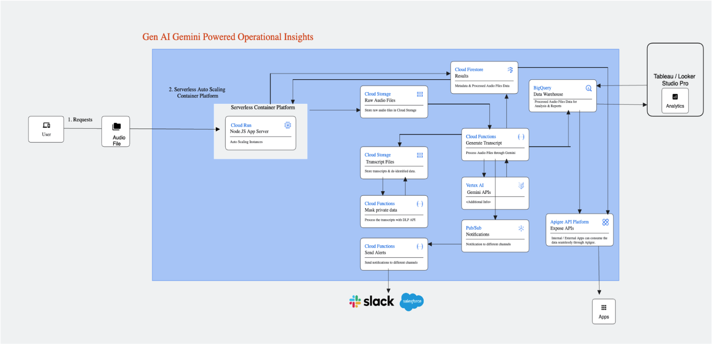

## Architecture

<p align="center"></p>

The main components that we would be setting up are (to learn more about these products, click on the hyperlinks)

* [Cloud Storage (GCS) bucket](https://cloud.google.com/storage/) : for storing uploaded Audio File data for processing.
* [Cloud Run](https://cloud.google.com/run/docs/overview/what-is-cloud-run) : For the main applicaiton logic as well as the streamlit UI for user interaction.


## Costs

Pricing Estimates - We have created a sample estimate based on some usage we see from new startups looking to scale. This estimate would give you an idea of how much this deployment would essentially cost per month at this scale and you extend it to the scale you further prefer. Here's the [link]
(https://cloud.google.com/products/calculator/estimate-preview/CiQzMWY0MzBiNS1hNTgwLTQzMDMtOTc4MS0zMjg3MzU2MmQxZGYQAQ==?hl=en).


## Deploy the architecture
Before we deploy the architecture, you will need the following information:
 * The **project ID**

Estimated deployment time: 15 min

Follow the steps below to deploy the architecture:

1. Click on Open in Google Cloud Shell button below.
<a href="https://ssh.cloud.google.com/cloudshell/editor?cloudshell_git_repo=https://github.com/GoogleCloudPlatform/click-to-deploy-solutions&cloudshell_workspace=data-loss-prevention&cloudshell_tutorial=tutorial.md" target="_new">
    
</a>

2. Run the prerequisites script to enable APIs permissions.

```sh
sh prereq.sh
```
Next, you'll be asked to enter the project ID of the destination project. Please provide the project ID when prompted.  

3. After this is complete, you can kick off the Cloud Run application Service with the following command:

```sh
gcloud run deploy audio-analysis-frontend  \
--source .  \
--region us-central1   \
--platform managed \
--port 8501 \
--timeout 600 \
--set-env-vars  PROJECT_ID=click-to-deploy-demo,GCS_INPUT_BUCKET=click-to-deploy-demo-audio_analysis_input,GCS_OUTPUT_BUCKET=click-to-deploy-demo-audio_analysis_output
```

> **_NOTE:_**  
> Upon executing this command, you will be prompted to specify whether you wish to create a new repository and allow unauthenticated invocations. Respond with `Y` to create the repository and `N` to disallow unauthenticated invocations.

4. Next, You need the cloud run service's url. To obtain the URL for "audio-analysis-frontend," execute the following command:

```sh
gcloud run services describe audio-analysis-frontend --region us-central1 --format 'value(status.url)'
```

6. And now you can run the following command to deploy the infrastructure:

```sh
cd infra/
terraform apply -var project_id=<PROJECT ID>
```

Change the `<PROJECT ID>` for your project id.