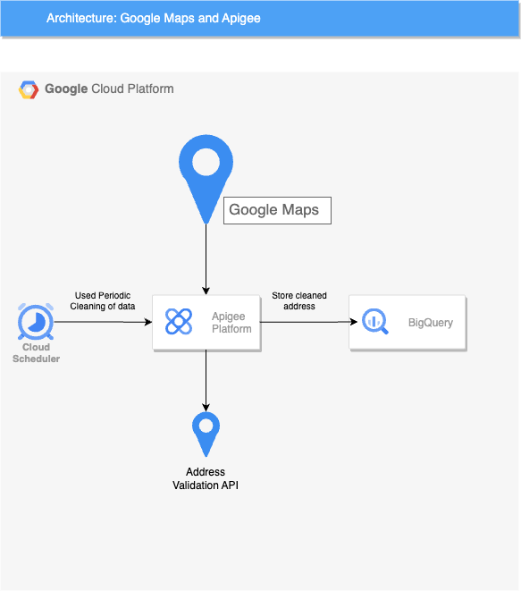

[](https://cloud.google.com/?utm_source=github&utm_medium=referral&utm_campaign=GCP&utm_content=packages_repository_banner)
# Better Togetter with Apigee

## Introduction
This architecture uses a serverless pipeline to securely process and validate addresses, ensuring data quality while leveraging Google Cloud services for scalability and efficiency. By integrating Apigee with the Address Validation API, it enables organizations to confidently cleanse and store address data without compromising accuracy.

In this architecture, address data is routed from its source to Apigee, a comprehensive API management platform. A Cloud Scheduler triggers periodic cleansing of address data, invoking Apigee to call the Address Validation API for data validation and standardization.

The Address Validation API inspects and validates the address entries, ensuring they conform to postal standards and are accurate. The validated and cleaned addresses are then stored in BigQuery, a fully-managed data warehouse, ready for further analysis and usage.

This architecture allows for seamless integration between address data routing, periodic cleansing, and the Address Validation API, enabling organizations to maintain high-quality address data while leveraging the scalability and efficiency of Google Cloud services. It ensures data accuracy and compliance with postal standards, safeguarding the integrity of customer and internal address information.

## Use cases
These are some examples of the use cases you can build on top of this architecture:

* __Address Standardization for CRM Systems__ : Organizations can use this architecture to ensure their CRM systems have accurate and standardized address data. By periodically cleansing and validating addresses stored in the CRM, the architecture improves data quality, reduces mailing errors, and enhances customer relationship management.

* __E-commerce Address Verification__ : E-commerce platforms can implement this architecture to validate customer shipping addresses at the point of entry. By integrating the Address Validation API through Apigee, the platform ensures that only accurate and deliverable addresses are accepted, reducing shipping errors and improving customer satisfaction.

* __Geospatial Data Analytics__ : Companies dealing with large datasets of geospatial information can leverage this architecture to maintain high-quality address data in their analytical models. By storing cleaned and validated addresses in BigQuery, organizations can perform more accurate geospatial analysis, enabling better decision-making for location-based services, marketing campaigns, and resource allocation.

## Architecture
<p align="center"></p>
The main components that we would be setting up are (to learn more about these products, click on the hyperlinks)


* [BigQuery](https://cloud.google.com/bigquery) : managed data warehouse solution that offers a powerful scalable SQL engine for analytical workloads
* [Apigee](https://cloud.google.com/apigee) : native API management tool, simplifies the creation, management, and security of APIs across diverse use cases, environments, and scales.
* [Cloud Scheduler](https://cloud.google.com/scheduler) : Cloud Scheduler is a fully managed cron job service that allows you to schedule virtually any job, including batch, big data jobs, cloud infrastructure operations, and more.

## Costs
Pricing Estimates - We have created a sample estimate based on some usage we see from new startups looking to scale. This estimate would give you an idea of how much this deployment would essentially cost per month at this scale and you extend it to the scale you further prefer. Here's the [link]().

## Deploy the architecture

:clock1: Estimated deployment time:  min

1. Click on Open in Google Cloud Shell button below.
<a href="" target="_new">
    
</a>

1. Run the prerequisites script to enable APIs and set Cloud Build permissions.
```
sh prereq.sh
```

1. Run the Cloud Build Job
```
gcloud builds submit . --config build/cloudbuild.yaml
```

Once it is finished, you can go to [Cloud Composer](https://console.cloud.google.com/composer/environments) to see the dags' results and explore the Cloud Composers's functionalities.

## Testing the architecture
After you deployed the solution, you can check the resources created and see how they work together.


## Cleaning up your environment
1. Click on Open in Google Cloud Shell button below.
<a href="" target="_new">
    
</a>

1. Run the command below on Cloud Shell to delete the resources.
```
gcloud builds submit . --config build/cloudbuild_destroy.yaml
```
