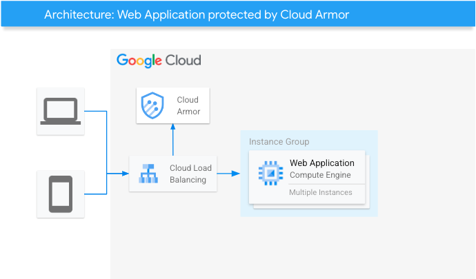

[](https://cloud.google.com/?utm_source=github&utm_medium=referral&utm_campaign=GCP&utm_content=packages_repository_banner)

# Protect your High Availability workloads with Load Balancer and Cloud Armor

## Introduction

_This architecture uses click-to-deploy so you can spin up infrastructure in minutes using terraform!_

DDoS attacks are a type of cyber attack that can overwhelm a website or server with traffic, making it unavailable to users. These attacks can be costly and disruptive, and they can negatively impact your business.**Cloud Armor** is a product that protects your applications against a wide range of attacks, including **SQL injection**, **cross-site scripting (XXS)** and **Denial of Service.** 

**Cloud load balancing** is a service that distributes incoming network or application traffic across multiple servers. This can help to improve the performance, reliability, and availability of your applications. **When you combine Cloud Armor and Load Balancing**, you can create a **powerfu**l and **scalable security solution **for your applications.** Cloud Armor** can **protect your applications** from a wide range of attacks, while **Load Balancing** can ensure your apps are **always available**.

Some workloads require high compute power or specific licenses while making sure the services are secured by a managed service and highly available across multiple regions. This [architecture](https://github.com/GoogleCloudPlatform/cloud-foundation-fabric/tree/master/blueprints/networking/glb-and-armor) consisting of Managed Instance Groups in multiple regions available through an HTTP Load Balancer with Cloud Armor enabled is suitable for such use-cases.

## Use cases

Shield your web applications with comprehensive protection and enjoy the ease of rapid deployment. Our click-to-deploy Terraform solution sets up a powerful combination of Cloud Armor and load balancing.  This ensures your applications remain secure and available, deflecting threats like DDoS, SQL injection, and XSS

This architecture caters to multiple workloads ranging from the ones requiring compliance with specific data access restrictions to compute-specific proprietary applications with specific licensing and OS requirements. Descriptions of some possible use-cases are as follows:

* __Protection from DDoS and Web Attacks__: Web applications remain vulnerable to threats such as Denial of Service (DDoS), SQL injection, and cross-site scripting (XSS) attacks. Cloud Armor actively protects your applications from these threats, while Load Balancing ensures your application remains available even under heavy traffic loads.
* __Industry-specific applications__: Demanding applications that need high compute power alongside robust network security can excel in this setup. The MIGs offer custom compute configurations, while Cloud Armor provides advanced security features like traffic control and DDoS protection.
* __Workloads requiring GDPR compliance__: Most applications require restricting data access and usage from outside a certain region (mostly to comply with data residency requirements). This architecture caters to such workloads as Cloud Armor allows you to lock access to your workloads from various fine-grained identifiers.
* __Medical Queuing systems__: Another great example usage for this  architecture will be applications requiring high compute power, availability and limited memory access requirements such as a medical queuing system.
* __Geofencing__: If you want to restrict content served on your application due to licensing restrictions (similar to OTT content in the US), Geofencing allows you to create a virtual perimeter to stop the service from being accessed outside the region. The architecture of using a Cloud Load Balancer with Cloud Armor enables you to implement geofencing around your applications and services.

## Architecture

<p align="center">  </p>

The main components that we would be setting up are (to learn more about these products, click on the hyperlinks):

* [Cloud Armor](https://cloud.google.com/armor) - Google Cloud Armor is the web-application firewall (WAF) and DDoS mitigation service that helps users defend their web apps and services at Google scale at the edge of Google’s network.
* [Cloud Load Balancer](https://cloud.google.com/load-balancing) - When your app usage spikes, it is important to scale, optimize and secure the app. Cloud Load Balancing is a fully distributed solution that balances user traffic to multiple backends to avoid congestion, reduce latency and increase security. Some important features it offers that we use here are:
  * Single global anycast IP and autoscaling - CLB acts as a frontend to all your backend instances across all regions. It provides cross-region load balancing, automatic multi-region failover and scales to support increase in resources.
  * Global Forwarding Rule - To route traffic to different regions, global load balancers use global forwarding rules, which bind the global IP address and a single target proxy.
  * Target Proxy - For external HTTP(S) load balancers, proxies route incoming requests to a URL map. This is essentially how you can handle the connections.
  * URL Map - URL Maps are used to route requests to a backend service based on the rules that you define for the host and path of an incoming URL.
  * Backend Service - A Backend Service defines CLB distributes traffic. The backend service configuration consists of a set of values - protocols to connect to backends, session settings, health checks and timeouts.
  * Health Check - Health check is a method provided to determine if the corresponding backends respond to traffic. Health checks connect to backends on a configurable, periodic basis. Each connection attempt is called a probe. Google Cloud records the success or failure of each probe.
* [Firewall Rules](https://cloud.google.com/vpc/docs/firewalls) - Firewall rules let you allow or deny connections to or from your VM instances based on a configuration you specify.
* [Managed Instance Groups (MIG)](https://cloud.google.com/compute/docs/instance-groups) - Instance group is a collection of VM instances that you can manage as a single entity. MIGs allow you to operate apps and workloads on multiple identical VMs. You can also leverage the various features like autoscaling, autohealing, regional / multi-zone deployments.

## Costs

Pricing Estimates - We have created a sample estimate based on some usage we see from new startups looking to scale. This estimate would give you an idea of how much this deployment would essentially cost per month at this scale and you extend it to the scale you further prefer. Here's the [link](https://cloud.google.com/products/calculator/#id=4690c11f-35e2-4eb1-9565-efb1fdd5faba).

## Deploy the architecture

Estimated deployment time: 4 min 23 sec

1. Click on Open in Google Cloud Shell button below.

<a href="https://ssh.cloud.google.com/cloudshell/editor?cloudshell_git_repo=https://github.com/GoogleCloudPlatform/click-to-deploy-solutions&cloudshell_workspace=cloud-armor-demo&cloudshell_open_in_editor=infra/terraform.tfvars" target="_new">
    
</a>

2. Run the prerequisites script to enable APIs and set Cloud Build permissions.
```
sh prereq.sh
```

3. Run the Cloud Build Job
```
gcloud builds submit . --config build/cloudbuild.yaml
```
## Testing the architecture

1. Verify that the Juice Shop Application is running
```
PUBLIC_SVC_IP="$(gcloud compute forwarding-rules describe juice-shop-http-lb  --global --format="value(IPAddress)")"
```
```
echo $PUBLIC_SVC_IP
```
Paste the output IP Address into your url bar to see the application

2. Verify that the Cloud Armor policies are blocking malicious attacks

LFI vulnerability

```
curl -Ii http://$PUBLIC_SVC_IP/?a=../
```

RCE Attack

```
curl -Ii http://$PUBLIC_SVC_IP/ftp?doc=/bin/ls
```

Well-known scanner detection
```
curl -Ii http://$PUBLIC_SVC_IP -H "User-Agent: blackwidow"
```

Protocol attack mitigation
```
curl -Ii "http://$PUBLIC_SVC_IP/index.html?foo=advanced%0d%0aContent-Length:%200%0d%0a%0d%0aHTTP/1.1%20200%20OK%0d%0aContent-Type:%20text/html%0d%0aContent-Length:%2035%0d%0a%0d%0a<html>Sorry,%20System%20Down</html>"
```

Session fixation attempt
```
curl -Ii http://$PUBLIC_SVC_IP/?session_id=a
```
3. All the above commands should return
```
HTTP/1.1 403 Forbidden
<..>
```

4. You can view the logs in Cloud Armor policies to verify these.

## Cleaning up your environment
Run the command below on Cloud Shell to destroy the resources.
```
gcloud builds submit . --config build/cloudbuild_destroy.yaml
```
