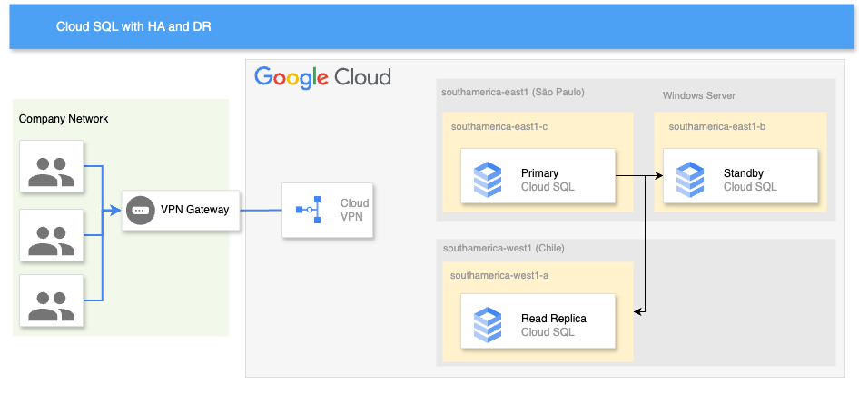

[](https://cloud.google.com/?utm_source=github&utm_medium=referral&utm_campaign=GCP&utm_content=packages_repository_banner)


# Prepare your Database for Disaster Recovery with Cloud SQL

## Introduction
_This architecture uses click-to-deploy so you can spin up infrastructure in minutes using terraform!_

In today's world, where downtime can cause significant revenue loss and impact customer satisfaction, having a highly available database is critical. Nowadays, critical, global applications require highly available databases that are able to provide low latency access to data and that minimize downtime caused by infrastructure failures or disasters. 

Whether you're a developer, a DevOps engineer, or a system administrator, this **click-to-deploy architecture** is designed to help you automate the deployment and management of your **Cloud SQL PostgreSQL database** with support for failover. With this solution, you can deploy a highly available relational database that ensures your data is always accessible and resilient to failures, while also providing disaster recovery capabilities in case of a disaster.

This blueprint creates a [Cloud SQL instance](https://cloud.google.com/sql) with multi-region read replicas as described in the [Cloud SQL for PostgreSQL disaster recovery](https://cloud.google.com/architecture/cloud-sql-postgres-disaster-recovery-complete-failover-fallback) article.

The solution is resilient to a regional outage. To get familiar with the procedure needed in the unfortunate case of a disaster recovery, please follow steps described in [part two](https://cloud.google.com/architecture/cloud-sql-postgres-disaster-recovery-complete-failover-fallback#phase-2) of the aforementioned article.

This repo is based on the Cloud Foundation Fabric blueprint available [here](https://github.com/GoogleCloudPlatform/cloud-foundation-fabric/tree/master/blueprints/data-solutions/cloudsql-multiregion)

## Use cases

These are some examples of the use cases you can build on top of this architecture:

* __Any application that requires a highly available database__
* __Financial Systems__ : Financial institutions and organizations dealing with sensitive financial data require robust data protection and uninterrupted access to their databases. Cloud SQL's high availability and disaster recovery solution offers the necessary safeguards to ensure the continuous availability of financial systems.

* __Healthcare and Life Sciences Applications__ : Applications in the healthcare and life sciences domains handle sensitive patient data, research findings, and critical medical information. Cloud SQL's high availability and disaster recovery solution provides the necessary infrastructure to protect and ensure the availability of this data.

* __ECommerce Platforms__ : ECommerce businesses heavily rely on continuous access to their databases to manage product inventory, process transactions, and provide a seamless shopping experience. With Cloud SQL's high availability and disaster recovery solution, ECommerce platforms can ensure uninterrupted database access, protect against data loss, and quickly recover from potential disasters.

* __Social media__: A social media platform that has users all over the world could use a multi-region database to improve performance and scalability.


## Architecture

<p align="center"></p>

The main components that we would be setting up are (to learn more about these products, click on the hyperlinks).

* [VPC](https://cloud.google.com/vpc) : Global virtual network that spans all regions. Single VPC for an entire organization, isolated within projects. Increase IP space with no downtime.
* Cloud SQL for Postgres instance with [high-availability](https://cloud.google.com/sql/docs/postgres/high-availability) : The purpose of an HA configuration is to reduce downtime when a zone or instance becomes unavailable. 
* Cloud SQL [cross-region read replica](https://cloud.google.com/sql/docs/postgres/intro-to-cloud-sql-disaster-recovery) instance : database disaster recovery (DR) is about providing continuity of processing, specifically when a region fails or becomes unavailable.

If you're migrating from another Cloud Provider, refer to [this](https://cloud.google.com/free/docs/aws-azure-gcp-service-comparison) documentation to see equivalent services and comparisons in Microsoft Azure and Amazon Web Services.

## Costs

Pricing Estimates - We have created a sample estimate based on some usage we see from new startups looking to scale. This estimate would give you an idea of how much this deployment would essentially cost per month at this scale and you extend it to the scale you further prefer. Here's the [link](https://cloud.google.com/products/calculator/#id=35b50e4b-8292-43b7-b909-d29213b80fea).

## Deploy the architecture

:clock1: Estimated deployment time: 16 min 30 sec

1. Click on Open in Google Cloud Shell button below.
<a href="https://ssh.cloud.google.com/cloudshell/editor?cloudshell_git_repo=https://github.com/GoogleCloudPlatform/click-to-deploy-solutions&cloudshell_workspace=cloudsql-ha-dr&cloudshell_open_in_editor=infra/terraform.tfvars" target="_new">
    
</a>

2. Run the prerequisites script to enable APIs and set Cloud Build permissions.
```
sh prereq.sh
```

3. Run the Cloud Build Job
```
gcloud builds submit . --config build/cloudbuild.yaml
```

## Testing the architecture

1. Initiate a failover to test Cloud SQL instance high availability. During this process, the instance will temporarily be unavailable for a few minutes while it switches over.
```
gcloud sql instances failover INSTANCE_NAME
```
2. Verify that the Cloud SQL instance has high availability configuration.
```
gcloud sql instances describe INSTANCE_NAME
```
The output should indicate availability Type as REGIONAL. The GceZone and secondary GceZone fields should show the current primary and secondary zones of the instance

## Cleaning up your environment

1. Click on Open in Google Cloud Shell button below.
<a href="https://ssh.cloud.google.com/cloudshell/editor?cloudshell_git_repo=https://github.com/GoogleCloudPlatform/click-to-deploy-solutions&cloudshell_workspace=cloudsql-ha-dr" target="_new">
    
</a>

2. Run the command below on Cloud Shell to delete the resources.
```
gcloud builds submit . --config build/cloudbuild_destroy.yaml
```
