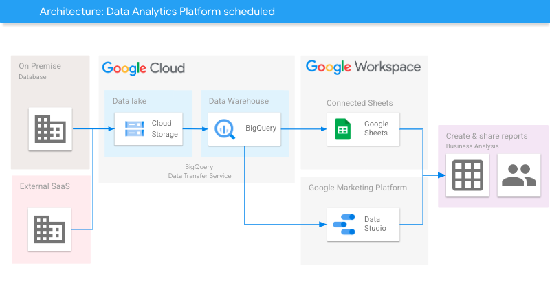

[](https://cloud.google.com/?utm_source=github&utm_medium=referral&utm_campaign=GCP&utm_content=packages_repository_banner)

# Automate transfer of data between Data Lake and Data Warehouse on Google Cloud using scheduled Jobs

## Introduction

This architecture uses click-to-deploy to load files from your Data Lake on Google Cloud Storage (GCS) to your Data Warehouse on BigQuery using scheduled jobs

At the core of this architecture is Google Cloud Storage (GCS), a highly scalable and durable object storage service, serving as the central repository for storing raw or structured data in the Data Lake.

The data loading process is orchestrated through [scheduled jobs](https://cloud.google.com/bigquery/docs/dts-introduction), which are automated tasks that run at predefined intervals. These jobs are responsible for extracting data from GCS and loading it into BigQuery, a fully managed, serverless data warehouse provided by Google Cloud. BigQuery offers powerful querying and analytics capabilities, enabling organizations to gain valuable insights from their data.

The following are some examples of how this architecture can be used to make processes more efficient and reduce manual labor:

* Automate the process of loading data from GCS into BigQuery on a daily, weekly, or monthly basis.

* Organizations can also use the architecture to load data from GCS into BigQuery in real time. This can be useful for organizations that need to analyze data as it is being generated, such as for fraud detection or customer churn prediction.

* Load data from GCS into BigQuery in parallel. This can be useful for organizations that have large amounts of data to load, as it can significantly reduce the time it takes to load the data.

## Use cases

These are some examples of the use cases you can build on top of this architecture:

* __Data Lake Consolidation__ : Organizations with multiple data lakes can utilize this architecture to consolidate their data into a centralized Data Warehouse. By scheduling jobs to extract data from various data lake repositories stored in GCS, organizations can transform and load the data into BigQuery for unified analytics.

* __Data Warehousing and Analytics__ : The architecture enables organizations to efficiently load data from Google Cloud Storage (GCS) to BigQuery, providing a powerful data warehousing and analytics solution. With scheduled jobs, organizations can automate the process of data loading, ensuring that the Data Warehouse is continuously refreshed with the latest data.

* __IoT Data Analysis__ : A manufacturing company could  implement the architecture to load sensor data from GCS into BigQuery in real-time. As sensors generate data from various manufacturing processes, the architecture ensures that the data is immediately ingested into BigQuery, allowing the organization to monitor and analyze the data in real-time.

## Architecture

<p align="center"></p>

The main components that we would be setting up are (to learn more about these products, click on the hyperlinks)

* [BigQuery](https://cloud.google.com/bigquery) : managed data warehouse solution that offers a powerful scalable SQL engine for analytical workloads
* [Cloud Storage (GCS) bucket](https://cloud.google.com/storage/) : Cloud Storage is a managed service for storing unstructured data. Store any amount of data and retrieve it as often as you like.
* [Service accounts:](https://cloud.google.com/iam/docs/service-accounts) : credentials used by Google Cloud services to interact with other Google Cloud components
* [BigQuery Data Transfer Service](https://cloud.google.com/bigquery/docs/dts-introduction) : automates data movement into BigQuery on a scheduled, managed basis.

## Costs

Pricing Estimates - We have created a sample estimate based on some usage we see from new startups looking to scale. This estimate would give you an idea of how much this deployment would essentially cost per month at this scale and you extend it to the scale you further prefer. Here's the [link](https://cloud.google.com/products/calculator#id=89190782-a6db-4d0b-977e-6fbdbe857a8a).

## Deploy

:clock1: Estimated deployment time: 2 min

1. Click on Open in Google Cloud Shell button below.
<a href="https://ssh.cloud.google.com/cloudshell/editor?cloudshell_git_repo=https://github.com/GoogleCloudPlatform/click-to-deploy-solutions&cloudshell_workspace=data-analytics-platform-scheduled&cloudshell_open_in_editor=terraform/terraform.tfvars" target="_new">
    
</a>

2. Run the prerequisites script to enable APIs and set Cloud Build permissions.
```
sh prereq.sh
```

3. Run the Cloud Build Job
```
gcloud builds submit . --config cloudbuild.yaml
```

Once it is finished, you can go to [Cloud Composer](https://console.cloud.google.com/composer/environments) to see the dags' results and explore the Cloud Composers's functionalities.


## Testing
After you deployed the solution, you can test it by loading the sample file from this repository to the Data Lake bucket by running the `gsutil` command below, or using the console.
```
gsutil cp sample_data/order_events_001.csv gs://your-upload-bucket/order-events/
```

Then, check the uploaded data on BigQuery > ecommerce dataset > order_events table.

## Destroy

1. Click on Open in Google Cloud Shell button below.
<a href="https://ssh.cloud.google.com/cloudshell/editor?cloudshell_git_repo=https://github.com/GoogleCloudPlatform/click-to-deploy-solutions&cloudshell_workspace=data-platform-scheduled" target="_new">
    
</a>

2. Run the command below on Cloud Shell to destroy the resources.
```
gcloud builds submit . --config cloudbuild_destroy.yaml
```
