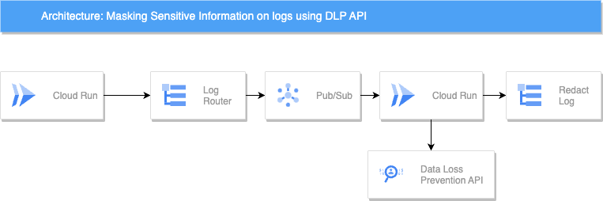

[](https://cloud.google.com/?utm_source=github&utm_medium=referral&utm_campaign=GCP&utm_content=packages_repository_banner)
# Protect you data using Data Loss Prevention

## Introduction
This architecture uses a serverless pipeline to securely process and store logs, ensuring sensitive information remains masked while retaining valuable insights for troubleshooting. By leveraging the Data Loss Prevention (DLP) API's powerful redaction capabilities, it enables organizations to confidently analyze log data without compromising data privacy.

In this architecture, log entries are routed from their source to Pub/Sub, a scalable messaging service. A Cloud Run pipeline then ingests these log entries, aggregates them into batches to optimize DLP API calls, and invokes the DLP service for content inspection and transformation.

The DLP service, utilizing pre-defined or custom infoType detectors, identifies sensitive information within the log entries. It then applies configurable masking techniques, such as tokenization or redaction, to obfuscate sensitive data. The transformed logs, now free of sensitive information, are then stored in a designated log bucket (e.g., Cloud Storage), ready for further analysis.

This architecture allows for seamless integration between log routing, batch processing, and the DLP API, enabling organizations to protect sensitive information while maintaining the utility of their log data for troubleshooting and analysis. It ensures compliance with data privacy regulations and best practices, safeguarding both customer data and internal confidential information.

## Use cases

* __Automated Sensitive Data Masking in Application Logs__ :This pipeline automatically masks sensitive information in application logs to prevent data breaches. Applications generate logs that are collected by Cloud Logging. The Log Router sends these logs to Pub/Sub, where Cloud Run processes them using the DLP API to identify and mask sensitive data. The masked logs are then securely stored back in Cloud Logging, ensuring compliance with data protection regulations.

* __Real-Time Compliance Monitoring and Reporting__ :Financial institutions can use this pipeline to comply with regulatory requirements by monitoring sensitive financial data in real-time. Application logs collected by Cloud Logging are forwarded to Pub/Sub. Cloud Run processes these logs, utilizing the DLP API to mask sensitive information. The de-identified logs are stored back in Cloud Logging, while a separate Cloud Run job or BigQuery can generate compliance reports automatically.

* __Incident Response and Alerting for Data Breaches__ :Organizations can enhance their incident response capabilities with this pipeline by detecting and responding to data breaches involving sensitive information. Application logs collected by Cloud Logging are sent to Pub/Sub. Cloud Run processes these logs with the DLP API to detect and mask sensitive data. Alerts are published to a separate Pub/Sub topic if sensitive data is detected, triggering incident response workflows via Cloud Functions or other services to notify security teams and initiate remediation processes.

## Architecture
<p align="center"></p>
The main components that we would be setting up are (to learn more about these products, click on the hyperlinks)

1. [Cloud Logging](https://cloud.google.com/logging) : fully managed service for storing, searching, analyzing, monitoring, and alerting on log data and events.
2. [Pub/Sub](https://cloud.google.com/pubsub) : asynchronous messaging service that allows for communication between services. It is used for streaming analytics, data integration, and event distribution.
3. [CloudRun](https://cloud.google.com/run): fully managed serverless platform on Google Cloud that allows you to effortlessly run stateless containers.It automatically scales your application based on traffic, ensuring optimal resource utilization and cost-efficiency.
4. [Cloud Data Loss Prevention](https://cloud.google.com/security/products/dlp) : a service offered by Google Cloud to help organizations discover, classify, and protect their most sensitive data.

## Costs

Pricing Estimates - We have created a sample estimate based on some usage we see from new startups looking to scale. This estimate would give you an idea of how much this deployment would essentially cost per month at this scale and you extend it to the scale you further prefer. Here's the [link](https://cloud.google.com/products/calculator/estimate-preview/168cc770-1b97-413b-9dbc-21a8adfee64f?hl=en). You can also get the idea for Data Loss Prevention pricing for [here](https://cloud.google.com/sensitive-data-protection/pricing#sensitive-data-protection-pricing)

## Deploy the architecture
Before we deploy the architecture, you will need the following information:
 * The **project ID**

Estimated deployment time: 15 min

Follow the steps below to deploy the architecture:

1. Click on Open in Google Cloud Shell button below.
<a href="" target="_new">
    
</a>

1. Run the prerequisites script to enable APIs permissions.

```sh
sh prereq.sh
```
Next, you'll be asked to enter the project ID of the destination project. Please provide the project ID when prompted.  

3. After this is complete, you can kick off the Cloud Run application Generate Service with the following command:

```sh
gcloud run deploy generate-service --source code/generator/ --region us-central1 --update-env-vars PROJECT_ID=<PROJECT ID>
```

> **_NOTE:_**  
> Upon executing this command, you will be prompted to specify whether you wish to create a new repository and allow unauthenticated invocations. Respond with `Y` to create the repository and `N` to disallow unauthenticated invocations.

4. Now, to proceed with the Redact Service application, follow these steps:

```sh
gcloud run deploy redact-service --source code/redact/ --region us-central1 --update-env-vars PROJECT_ID=<PROJECT ID>
```

> **_NOTE:_** 
> Upon executing this command, you will be asked whether to allow unauthenticated invocations. Respond with `N` to disallow such invocations.

If you face any issues while running these commands,please attempt to run them again in a clean project.

5. Now you need to create a log router that will intercept de generate-service's logs and send them to the Pub/Sub. The Pub/Sub will send every message to redact-service which will apply the necessary masking to protect sensitive information.

You need the redact-service's url. To obtain the URL for "redact-service," execute the following command:

```sh
gcloud run services describe redact-service --region us-central1 --format 'value(status.url)'
```

6. And now you can run the following command to deploy the DLP project:

```sh
terraform apply -var project_id=<PROJECT ID>
```

Change the `<PROJECT ID>` for your project id.

## Result

Congratulations! The DLP project deployment should now be underway. Please be patient as this process might take some time. Kindly keep this window open during the deployment. Once completed, we'll proceed to test the architecture and then guide you through cleaning up your environment.

## Testing the architecture

1. Once you have deployed the solution successfully, let's test. Run the below command to check the log:

```sh
gcloud beta run services logs read redact-service --limit=20 --project <PROJECT ID> --region us-central1
```

Check the logs in the output.

Example:

```json
{
  'name': '[SENSITIVE DATA]',
  'email': '[SENSITIVE DATA]',
  'address': '1234 [SENSITIVE DATA]',
  'phone_number': '123456789',
  'ssn': '[SENSITIVE DATA]',
  'credit_card_number': '123456789'
}
```

## Cleaning up your environment


1. Execute the command below on Cloud Shell to destroy the resources.

```sh
terraform destroy -var project_id=<PROJECT ID>
```

3. To delete Cloud Run, execute the below commands :

```sh
gcloud run services delete redact-service --region us-central1
```

```sh
gcloud run services delete generate-service --region us-central1
```

4. We also need to delete the images that were generated. Run the below command to delete the images:

```sh
gcloud artifacts docker images delete us-central1-docker.pkg.dev/<PROJECT ID>/cloud-run-source-deploy/generate-service
```

```sh
gcloud artifacts docker images delete us-central1-docker.pkg.dev/<PROJECT ID>/cloud-run-source-deploy/redact-service
```

The above commands will delete the associated resources so there will be no billable charges made afterwards.


