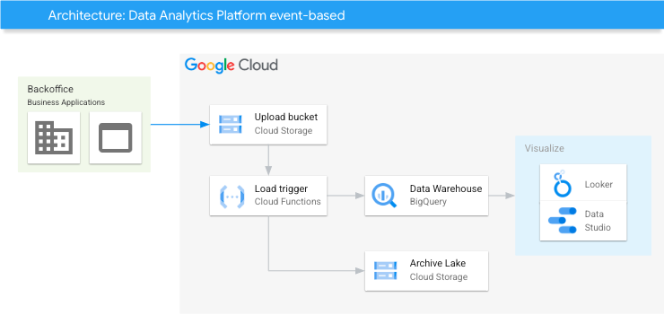

# GCP BQ batch load

## Description

This example demonstrates how to load files from GCS directly to BigQuery, and archive them for long-term purposes.

### Use case
Upload the data into the upload bucket following the pattern `gs://your-upload-bucket/dataset-name/table-name/file.csv`.

This upload will trigger a Cloud Function that extracts the parameters from the object path and then load the file into the table.

## Architecture
Please find below a reference architecture.


## Deploy

1. Click on Open in Google Cloud Shell button below.
<a href="https://ssh.cloud.google.com/cloudshell/editor?cloudshell_git_repo=https://github.com/GoogleCloudPlatform/click-to-deploy-solutions&cloudshell_workspace=cloud-composer-etl" target="_new">
    
</a>

2. Run the `cloudbuild.sh` script and follow the instructions
```
sh cloudbuild.sh
```

Once it is finished, you can go to [Cloud Composer](https://console.cloud.google.com/composer/environments) to see the dags' results and explore the Cloud Composers's functionalities.


## Destroy

1. Click on Open in Google Cloud Shell button below.
<a href="https://ssh.cloud.google.com/cloudshell/editor?cloudshell_git_repo=https://github.com/GoogleCloudPlatform/click-to-deploy-solutions&cloudshell_workspace=data-platform-event-based" target="_new">
    
</a>

2. Run the `cloudbuild.sh` script with `destroy` argument
```
sh cloudbuild.sh destroy
```
