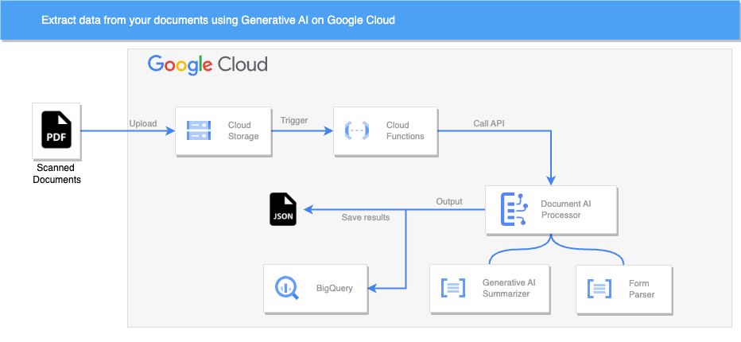
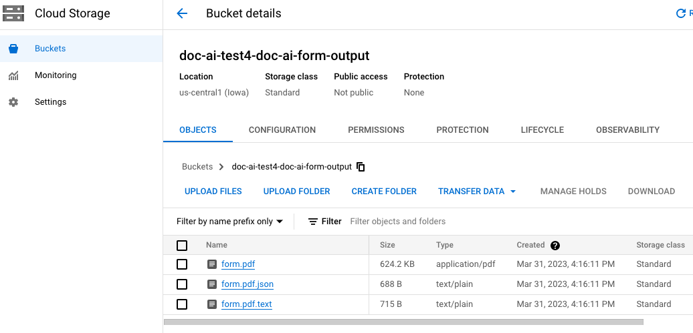

[](https://cloud.google.com/?utm_source=github&utm_medium=referral&utm_campaign=GCP&utm_content=packages_repository_banner)

# Extract data from your documents using AI on Google Cloud

## Introduction

This architecture uses click-to-deploy to create a pipeline for extracting data from documents with Document AI and storing valuable data on Big Query.

This architecture is designed to extract data from documents using Google Document AI form processor and combine the power of a scalable data warehouse like Big Query enabling organizations to automate the extraction of structured data from various types of documents, such as forms, invoices, receipts, and more. 

In this architecture, documents are uploaded to Google Cloud Storage. An event trigger is set up to detect new document uploads, which then triggers a primary Cloud Function which utilizes the Google Document AI form processor, a powerful machine learning-based service, to analyze the documents and extract structured data from them.

The Document AI form processor applies machine learning models to automatically identify form fields, extract their values, and map them to appropriate data types. It leverages advanced techniques such as optical character recognition (OCR), natural language processing, and entity extraction to accurately extract structured data from the documents. The extracted form data is then saved to BigQuery so Organizations can leverage BigQuery's powerful querying capabilities, data visualization tools, and machine learning capabilities to gain insights from the extracted form data. 

In summary , this architecture allows for seamless integration between the Document AI form processor and BigQuery, enabling organizations to automate the extraction of structured data from documents and leverage it for various analytics and decision-making purposes.

## Use cases
These are some examples of the use cases you can build on top of this architecture:

* __Invoice Processing Automation__ : This pipeline can automate the extraction of key data from invoices, such as vendor details, invoice numbers, line item information, and total amounts. Organizations can streamline their accounts payable processes, reduce manual data entry, and improve accuracy in invoice processing.

* __Contract Management and Analysis__ : Organizations can utilize the pipeline to efficiently process and analyze contracts. Document AI can extract critical information from contracts, such as parties involved, key terms and conditions, effective dates, and obligations.

* __Document Classification and Sorting__ : The document processing pipeline can be utilized to classify and sort large volumes of documents automatically. By leveraging Document AI's capabilities, the pipeline can analyze the content of documents, identify patterns, and classify them into specific categories.


## Architecture

<p align="center"></p>

The main components that we would be setting up are (to learn more about these products, click on the hyperlinks)

* [Cloud Storage (GCS) bucket](https://cloud.google.com/storage/) : for storing extracted data that must undergo some kind of transformation.
* [Big Query](https://cloud.google.com/bigquery) : Serverless and cost-effective enterprise data warehouse that works across clouds and scales with your data.
* [Document AI ](https://cloud.google.com/document-ai) : Extract structured data from documents and analyze, search and store this data. 
* [Cloud Function](https://cloud.google.com/functions) : Run your code in the cloud with no servers or containers to manage with our scalable, pay-as-you-go functions as a service (FaaS) product.

## Costs

Pricing Estimates - We have created a sample estimate based on some usage we see from new startups looking to scale. This estimate would give you an idea of how much this deployment would essentially cost per month at this scale and you extend it to the scale you further prefer. Here's the [link](https://cloud.google.com/products/calculator/#id=7e79b4d5-7060-4ab4-a78e-d81dadc8a9fb).

## Deploy the architecture

:clock1: Estimated deployment time: 10 min

1. Click on Open in Google Cloud Shell button below.

<a href="https://ssh.cloud.google.com/cloudshell/editor?cloudshell_git_repo=https://github.com/GoogleCloudPlatform/click-to-deploy-solutions&cloudshell_workspace=document-ai&cloudshell_open_in_editor=terraform/terraform.tfvars&cloudshell_tutorial=tutorial.md" target="_new">
    
</a>

2. Run the prerequisites script to enable APIs and set Cloud Build permissions.
```
sh prereq.sh
```

3. Run the Cloud Build Job
```
gcloud builds submit . --config build/cloudbuild.yaml
```

If you face a problem with the EventArc API during the deployment, please check out the [known issues section](#known-issues).

## Testing the architecture 

Once you deployed the solution successfully, upload the `form.pdf` to the input bucket using either Cloud Console or `gsutil`.
```
gsutil cp assets/form.pdf gs://<YOUR PROJECT NAME>-doc-ai-form-input
```

Then, check the parsed results in the output bucket in text (OCR) and json (Key=value) formats



Finally, check the json results on BigQuery


## Cleaning up your environment
Execute the command below on Cloud Shell to delete the resources.
```
gcloud builds submit . --config build/cloudbuild_destroy.yaml
```

## Known issues

You might face the error below while running it for the first time.

```
Step #2 - "tf apply": │ Error: Error creating function: googleapi: Error 400: Cannot create trigger projects/doc-ai-test4/locations/us-central1/triggers/form-parser-868560: Invalid resource state for "": Permission denied while using the Eventarc Service Agent.

If you recently started to use Eventarc, it may take a few minutes before all necessary permissions are propagated to the Service Agent. Otherwise, verify that it has Eventarc Service Agent role.
```

It happens because the Eventarc permissions take some time to propagate. First, make sure you ran the `pre-req.sh` script. Then, wait some minutes and trigger the deploy job again. Please see the [Known issues for Eventarc](https://cloud.google.com/eventarc/docs/issues).


## Useful links
- [Form Parsing with Document AI](https://codelabs.developers.google.com/codelabs/docai-form-parser-v1-python#0)
- [Use a Document AI para processar seus formulários escritos à mão de maneira inteligente (Python)](https://codelabs.developers.google.com/codelabs/docai-form-parser-v3-python?hl=pt-br#0) (Portuguese)

