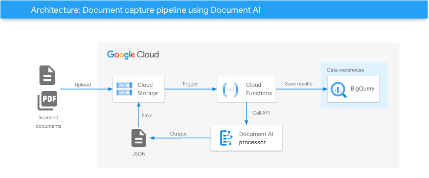

# Document OCR

This example deploys a solution for extracting data from documents with Document AI OCR.
The documents uploaded input buckets are processed by Document AI, then results are pushed to output bucket.

## Architecture


## Deploy

1. Click on Open in Google Cloud Shell button below.
<a href="https://ssh.cloud.google.com/cloudshell/editor?cloudshell_git_repo=https://github.com/GoogleCloudPlatform/click-to-deploy-solutions&cloudshell_workspace=document-ai" target="_new">
    
</a>

2. Run the `cloudbuild.sh` script and follow the instructions
```
sh cloudbuild.sh
```

## Destroy
Execute the command below on Cloud Shell to destroy the resources.
```
sh cloudbuild.sh destroy
```


## Useful links
- [Form Parsing with Document AI](https://codelabs.developers.google.com/codelabs/docai-form-parser-v1-python#0)
- [Use a Document AI para processar seus formulários escritos à mão de maneira inteligente (Python)](https://codelabs.developers.google.com/codelabs/docai-form-parser-v3-python?hl=pt-br#0) (Portuguese)
