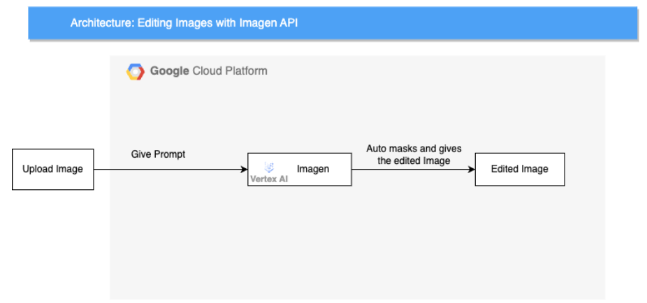

# Editing Using Imagen

This document outlines a streamlined workflow for editing images using Google's Imagen AI model on the Vertex AI platform. The process begins with the user uploading an image and providing a natural language text prompt describing the desired edits. Imagen, running on Vertex AI, then leverages its powerful generative AI capabilities to interpret the prompt and intelligently apply the desired edits, including automatic masking of relevant areas for precise and targeted results. The final edited image is subsequently returned to the user. This solution simplifies and accelerates image editing, allowing users to achieve desired results through intuitive text instructions.

## Use cases

* __Product Image Enhancement__: Automatically improve product images for e-commerce websites. Using Imagen, businesses can enhance product images by removing backgrounds, adjusting lighting, or even adding special effects like a "glossy" finish. This can be done in bulk, saving significant time and resources compared to manual editing.
* __Personalized Marketing Collateral__: Create customized marketing materials featuring user-generated images. Imagine a travel agency that encourages customers to submit photos from their trips. Using Imagen, the agency can seamlessly edit these images to incorporate their branding or promotional messages, creating unique and engaging marketing content that resonates with individual customers.
* __Social Media Content Creation__: Quickly generate visually appealing images for social media posts. Social media managers can use Imagen to modify images with filters, add text overlays, or resize them to fit different platform requirements. This streamlines the content creation process and ensures a consistent brand aesthetic across all channels.

## Architecture

The main components that we would be setting up are (to learn more about these products, click on the hyperlinks)

1. [Imagen](https://cloud.google.com/use-cases/text-to-image-ai) : Imagen is a powerful AI model from Google that generates and edits images from text descriptions.
2. [Vertex AI](https://cloud.google.com/vertex-ai) : Fully managed platform streamlining the entire machine learning lifecycle, from development to production, with powerful tools and infrastructure.

## Costs
Pricing Estimates - We have created a sample estimate based on some usage we see from new startups looking to scale. This estimate would give you an idea of how much this deployment would essentially cost per month at this scale and you extend it to the scale you further prefer. Here's the [link](https://cloud.google.com/products/calculator/estimate-preview/15e38d2d-f023-4d94-958f-3688d89f0cdf?e=48754805&hl=en).

## Result

Congratulations! The GenAI for marketing project deployment should now be underway. Please be patient as this process might take some time. Kindly keep this window open during the deployment. Once completed, we'll proceed to test the architecture and then guide you through cleaning up your environment.