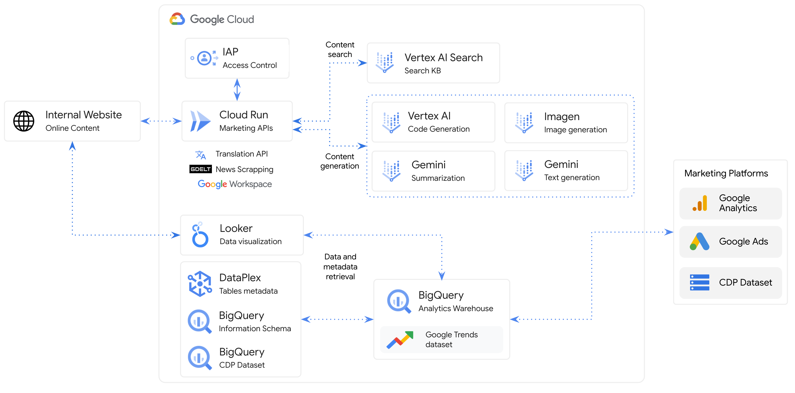

[](https://cloud.google.com/?utm_source=github&utm_medium=referral&utm_campaign=GCP&utm_content=packages_repository_banner)
# GenAI for Marketing

## Introduction
This architecture harnesses generative AI to empower marketing initiatives, leveraging a diverse set of Google Cloud components to fuel content creation, data analysis, and campaign optimization.  It illustrates how large language models (LLMs) like Gemini can be used to generate various types of marketing content, including ad copy, social media posts, and product descriptions.

In this architecture, internal and external data sources feed into Google Cloud's suite of AI capabilities. Cloud Run, a serverless compute platform, enables the flexible execution of marketing workflows. Vertex AI, Google Cloud's machine learning platform, provides the foundation for deploying and managing generative AI models like Imagen and Gemini.

Content generation is a key focus of this architecture.  LLMs transform raw data into compelling marketing copy, while Imagen generates eye-catching visuals. These assets are then distributed across various marketing platforms, including Google Ads and social media.

Data analysis and visualization tools, such as Looker and BigQuery, provide insights to guide marketing strategies and measure campaign effectiveness. This data-driven approach ensures that marketing efforts are continually refined and optimized.

This architecture showcases the transformative potential of generative AI in marketing, automating content creation, personalizing customer experiences, and unlocking data-driven insights. By integrating generative AI into their marketing strategies, businesses can enhance efficiency, creativity, and overall campaign performance.

## Use cases

* __Marketing Insights__: Utilize Looker Dashboards to access and visualize marketing data, powered by Looker dashboards, marketers can access and visualize marketing data to build data driven marketing campaigns. These features can empower businesses to connect with their target audience more efficiently, thereby improving conversion rates.
* __Audience and Insight finder__ : Conversational interface that translates natural language into SQL queries. This democratizes access to data for non-SQL users removing any bottleneck for marketing teams.
* __Trendspotting__: Identify emerging trends in the market by analyzing Google Trends data on a Looker dashboard and summarize news related to top search terms. This can help businesses to stay ahead of the competition and to develop products and services that meet the needs and interests of their customers.
* __Content Search__: Improve search experience for internal or external content with Vertex AI Search for business users.
* __Content Generation__: Reduce time for content generation with Vertex Foundation Models. Generate compelling and captivating email copy, website articles, social media posts, and assets for PMax. All aimed at achieving specific goals such as boosting sales, generating leads, or enhancing brand awareness. This encompasses both textual and visual elements using Vertex language & vision models.

## Architecture
<p align="center"></p>
The main components that we would be setting up are (to learn more about these products, click on the hyperlinks)

1. [Looker](https://cloud.google.com/looker) :  Empowering data exploration and informed decision-making through a user-friendly interface and powerful visualization capabilities
2. [Vertex AI](https://cloud.google.com/vertex-ai) : Fully managed platform streamlining the entire machine learning lifecycle, from development to production, with powerful tools and infrastructure.
3. [CloudRun](https://cloud.google.com/run): fully managed serverless platform on Google Cloud that allows you to effortlessly run stateless containers.It automatically scales your application based on traffic, ensuring optimal resource utilization and cost-efficiency.
4. [BigQuery](https://cloud.google.com/bigquery) : a service offered by Google Cloud to help organizations discover, classify, and protect their most sensitive data.

## Costs

Pricing Estimates - We have created a sample estimate based on some usage we see from new startups looking to scale. This estimate would give you an idea of how much this deployment would essentially cost per month at this scale and you extend it to the scale you further prefer. Here's the [link](https://cloud.google.com/products/calculator/estimate-preview/cdd3ca1c-f9ce-419b-a176-c3eec8b8087c?e=48754805&hl=en).


## Deploy the architecture

Before we deploy the architecture, you will need the following information:
 * The **project ID**

Estimated deployment time: 15 min

Follow the steps below to deploy the architecture:

1. Click on Open in Google Cloud Shell button below.
<a href="" target="_new">
    
</a>

1. Run the prerequisites script to enable APIs permissions.

```sh
sh prereq.sh
```
Next, you'll be asked to enter the project ID of the destination project. Please provide the project ID when prompted.  

## Result

Congratulations! The GenAI for marketing project deployment should now be underway. Please be patient as this process might take some time. Kindly keep this window open during the deployment. Once completed, we'll proceed to test the architecture and then guide you through cleaning up your environment.

## Testing the architecture

Once you have deployed the solution successfully, let's test. Run the below command to check the log:


## Cleaning up your environment


The above commands will delete the associated resources so there will be no billable charges made afterwards.


