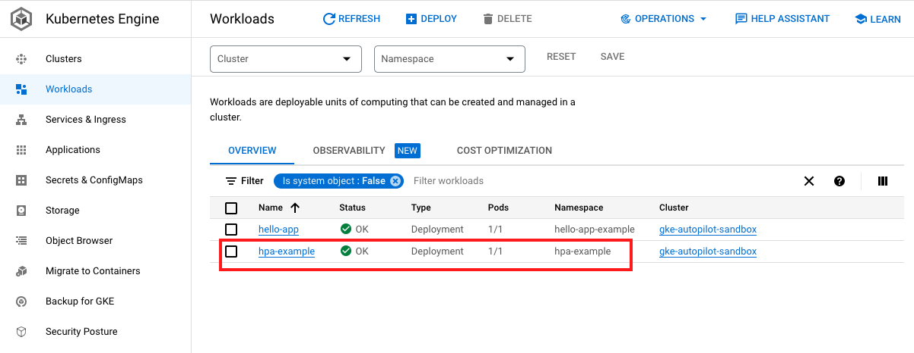
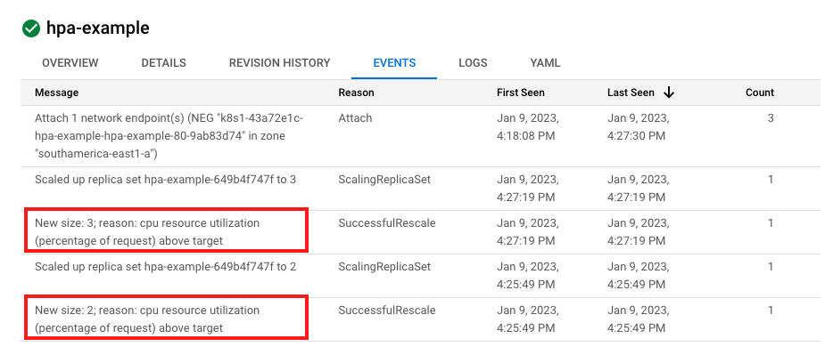

[](https://cloud.google.com/?utm_source=github&utm_medium=referral&utm_campaign=GCP&utm_content=packages_repository_banner)

# Google Kubernetes Engine HPA

## Description

This example deploys Google Kubernetes Engine (GKE) Autopilot cluster with two sample deployments: hello-app-example and hpa-example. It demonstrate how to use Horizontal Pod Autoscaling (HPA) to scale the number of pods based on CPU utilization.

Resources created:
- VPC
- Subnet
- NAT
- GKE Autopilot

## Architecture


## Deploy

1. Click on Open in Google Cloud Shell button below.
<a href="https://ssh.cloud.google.com/cloudshell/editor?cloudshell_git_repo=https://github.com/GoogleCloudPlatform/click-to-deploy-solutions&cloudshell_workspace=gke-autopilot-hpa" target="_new">
    
</a>

2. Run the `cloudbuild.sh` script and follow the instructions
```
sh cloudbuild.sh
```

## Executing a load test
Once you deployed the solution, you can run a load test and see the HPA in action.

Go to [Workloads](https://console.cloud.google.com/kubernetes/workload/overview) page and see the `hpa-example` application has one replica.

- 

To run the load test and see the HPA working, go back to the Cloud Shell console, go to this repo dir you cloned earlier, then run the load test script. For example:

```
HPA_LB_IP=$(gcloud compute addresses describe hpa-lb-ip --global --format='value(address)')
sh load_test.sh $HPA_LB_IP
```

The script will call the service many times causing the CPU to cross the target defined in the HPA for scaling out.

- 

## Destroy
Execute the command below on Cloud Shell to destroy the resources.
```
sh cloudbuild.sh destroy
```
