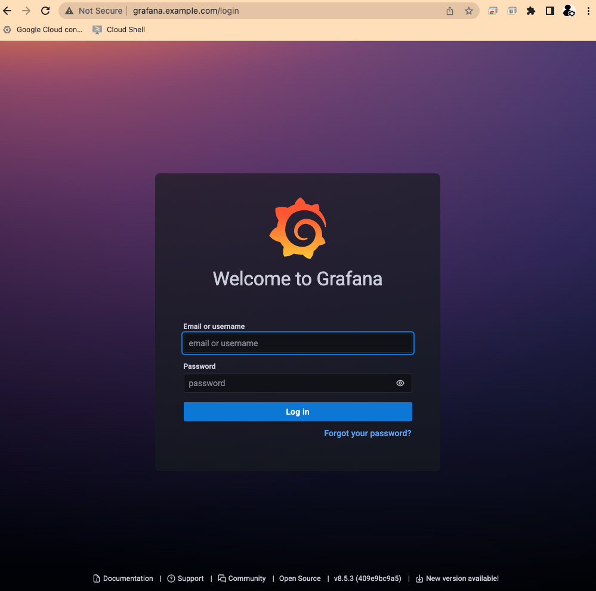

[](https://cloud.google.com/?utm_source=github&utm_medium=referral&utm_campaign=GCP&utm_content=packages_repository_banner)

# Leverage NGINX for Load Balancing in a Kubernetes Architecture

## Introduction
This architecture uses click-to-deploy so you can spin up a GKE cluster with [NGINX](https://www.nginx.com/) for load balancing.

In the fast-paced world of software development, organizations strive to achieve efficient and automated processes to deliver high-quality applications at a rapid pace. To accomplish this, companies leverage technologies like Google Kubernetes Engine (GKE) for container orchestration, Jenkins to implement CI/CD pipelines, and Prometheus Stack for monitoring.. 

This architecture enables the company to achieve several key benefits. Firstly, it automates and streamlines the application deployment process, reducing manual intervention and improving deployment consistency. Secondly, it ensures scalability and high availability by leveraging GKE's container orchestration capabilities, allowing applications to scale dynamically to handle varying workloads. Thirdly, the integrated monitoring stack provides valuable insights into the system's performance, allowing the company to proactively address any issues, optimize resource usage, and ensure a high-quality user experience.

Overall, this architecture offers a robust and efficient solution for modern application deployment, enabling the company to accelerate their software development processes, improve scalability and reliability, and gain valuable insights into application performance. 

## Use Cases

These are some examples of the use cases you can build on top of this architecture:

* __Web applications__: This architecture can be used to deploy and manage web applications. The Nginx controller can be used to load balance traffic across multiple pods or nodes in a cluster, and Jenkins can be used to automate the deployment of applications to Kubernetes. Prometheus can be used to collect metrics from the web applications and to generate alerts when applications are unhealthy or when performance metrics are outside of acceptable ranges.

* __Automated Deployment and Testing__: With GKE and Jenkins, you can set up an automated CI/CD pipeline that enables seamless deployment of applications to the Kubernetes cluster.Jenkins can be configured to monitor source code repositories, trigger build processes, run automated tests, and deploy application containers to GKE.Utilize the Prometheus Stack to collect and analyze metrics from the deployment pipeline, monitoring the application's performance and ensuring its stability.

* __Scalable and Resilient Deployment__: By combining GKE with NGINX, you can achieve scalable and resilient application deployments. NGINX acts as a reverse proxy and load balancer in front of the GKE cluster, efficiently distributing traffic to the application containers. GKE's built-in scalability features, combined with NGINX's load balancing capabilities, allow the infrastructure to handle increasing user loads and ensure high availability.

## Architecture
<p align="center"></p>

The main components that we would be setting up are (to learn more about these products, click on the hyperlinks)

* [VPC](https://cloud.google.com/vpc) with Private Service Access to deploy the instances and VM
* [Google Kubernetes Engine cluster](https://cloud.google.com/kubernetes-engine) : The most scalable and fully automated Kubernetes service
* [Load Balancers](https://cloud.google.com/load-balancing) : When your app usage spikes, it is important to scale, optimize and secure the app. Cloud Load Balancing is a fully distributed solution that balances user traffic to multiple backends to avoid congestion, reduce latency and increase security.

#### Applications deployed:

* [Jenkins](https://cloud.google.com/kubernetes-engine/docs/archive/jenkins-on-kubernetes-engine) : Jenkins is an open-source automation server that lets you flexibly orchestrate your build, test, and deployment pipelines.
* [Prometheus Stack](https://cloud.google.com/stackdriver/docs/managed-prometheus) (Prometheus, Grafana, and Alert Manager).

## Deploy
:clock1: Estimated deployment time: 13 min

1. Click on Open in Google Cloud Shell button below.
<a href="https://ssh.cloud.google.com/cloudshell/editor?cloudshell_git_repo=https://github.com/GoogleCloudPlatform/click-to-deploy-solutions&cloudshell_workspace=gke-standard-nginx" target="_new">
    
</a>

2. Run the `cloudbuild.sh` script and follow the instructions
```
sh cloudbuild.sh
```


## Testing

In this example, we use an example domain (example.com), so you need to set the NGINX IP it in your `/etc/hosts` file in order to access the appications.

Go to the [GKE Services](https://console.cloud.google.com/kubernetes/discovery) and copy the external IP assigned to `ingress-nginx-controller`, then add it to your machine's `/etc/hosts` alongside `<app>.example.com`, for example:
```
##
# Host Database
#
# localhost is used to configure the loopback interface
# when the system is booting.  Do not change this entry.
##
127.0.0.1       localhost
255.255.255.255 broadcasthost
::1             localhost

34.95.133.118   jenkins.example.com
34.95.133.118   grafana.example.com
34.95.133.118   prometheus.example.com
```

NOTE: In your environment, please use a proper domain and set DNS records.


Save the file and try to access the application http://grafana.example.com, it should work:



## Destroy

1. Click on Open in Google Cloud Shell button below.
<a href="https://ssh.cloud.google.com/cloudshell/editor?cloudshell_git_repo=https://github.com/GoogleCloudPlatform/click-to-deploy-solutions&cloudshell_workspace=gke-standard-nginx" target="_new">
    
</a>

2. Run the `cloudbuild.sh` script with `destroy` argument.
```
sh cloudbuild.sh destroy
```
