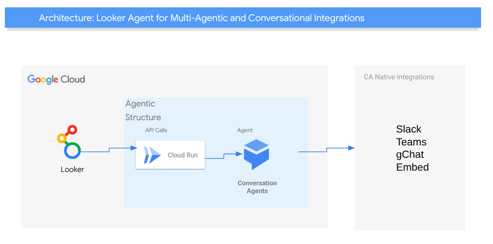

[](https://cloud.google.com/?utm_source=github&utm_medium=referral&utm_campaign=GCP&utm_content=packages_repository_banner)

# Looker Data Agent Deployment

## Introduction
The Looker Data Agent seamlessly integrates trusted, real-time data into your teams' daily workflows in tools like Google Chat and Slack. This guide provides a step-by-step approach to building a conversational analytics interface through connecting Looker data with conversational agents in your team's collaboration platforms. Whether you're looking to integrate with Slack, Google Chat, or Teams, this solution provides an efficient method to put real-time data insights directly into the flow of your team's work.

The architecture uses a Google Cloud Run service to connect Looker's API with conversational agents in platforms like Slack or Teams.

This guide is designed for users who already have a Google Cloud project and want to query trusted data using natural language in a chat channel and get an immediate, data-backed answer directly from Looker. 

## Use cases
The Looker Agent unlocks a wide range of use cases that drive productivity, streamline workflows, and empowers everyone to make data-driven decisions. Here are some applicable use cases:

* __Self-Service Analytics__: Eliminates bottlenecks and reduces the burden on data analysts by enabling self-service analytics, empowering every user to make data-driven decisions without needing to be an expert in SQL or a specific dashboard.
* __Cross-Functional Team Collaboration__: Acts as a universal data interface within collaborative platforms like Google Chat or Slack, breaking down silos between departments. It allows teams to share and discuss a single source of truth without leaving their conversation. This ensures all teams are aligned and working with consistent information, leading to better, faster decisions.
* __Strategic & Executive Insights__: For leadership and management, the Looker agent provides a quick way to get a pulse on the business from their preferred communication tool. This democratizes high-level strategic data, allowing leaders to easily access key performance indicators (KPIs) and make informed decisions without waiting for formal reports or presentations.
* __Customer Service & Support Management__: Monitor and improve customer service operations by querying the agent for key metrics like average ticket resolution time, customer satisfaction scores (CSAT), or the number of open tickets per agent. This allows for proactive management, workload balancing, and a better understanding of customer pain points.
* __Sales Performance & Reporting__: A sales team can quickly get real-time insights without leaving their communication platform. For example, a sales manager could ask, "What is our team's Q3 revenue in the West region?" or a sales representative could query, "How many new leads were assigned to me this month?

## Architecture



These are the main components that we would be setting up (to learn more about these products, click on the hyperlinks):
* [Looker](https://cloud.google.com/looker) :  Empowering data exploration and informed decision-making through a user-friendly interface and powerful visualization capabilities
* [Cloud Run](https://cloud.google.com/run): Serverless PaaS offering to host containers for web-oriented applications, while offering security, scalability and easy versioning.
* [Conversational Agents](https://cloud.google.com/conversational-agents): Provide proactive, personalized self service and natural, human-like voices for highly engaging customer experiences.


## Cost

Pricing Estimates - We have created a sample estimate based on some usage we see from new startups looking to scale. This estimate would give you an idea of how much this deployment would essentially cost per month at this scale and you extend it to the scale you further prefer. Here's the [link](https://cloud.google.com/products/calculator/estimate-preview/3de21092-1d49-43bd-8101-d06aa2a54e64?isLegacy=true&e=48754805&hl=en).


## Deploy the architecture

**Time to complete**: About 5 minutes

1. Click on Open in Google Cloud Shell button below.

<a href="https://ssh.cloud.google.com/cloudshell/editor?shellonly=true&cloudshell_git_repo=https://github.com/GoogleCloudPlatform/click-to-deploy-solutions&cloudshell_workspace=text-classification&cloudshell_open_in_editor=infra/terraform.tfvars" target="_new">
    
</a>

2. Run the prerequisites script to enable APIs and set Cloud Build permissions.
```
sh prereq.sh
```

3. Run the Cloud Build Job
```
gcloud builds submit . --config cloudbuild.yaml
```


## Result

At this point you have successfully deployed the application and necessary underlining infrastructure to run it! Yay!

This process may take a while to deploy, please do not close the window when deploying.

Next we are going to test the architecture and finally clean up your environment.

## Getting the endpoint
* Visit Cloud Run list of services (https://console.cloud.google.com/run) 
* Select the service called text-classification	
* The service endpoint will be available right next to the package name


## Testing your architecture
Once you deployed the solution successfully, update the populate.sh with the endpoint you got from the previous step


```bash
sh populate.sh
```

Then, check the parsed results in the output bucket in text (OCR) and json (Key=value) formats

Finally, check the json results on BigQuery or even better, use the bellow link to check it in a Looker Studio dashboard.

```
https://lookerstudio.google.com/c/u/0/reporting/create?c.mode=edit&ds.connector=BIG_QUERY&ds.type=TABLE&ds.projectId=[YOUR PROJECT ID]&ds.datasetId=classified_messages&ds.tableId=classified_messages
```

## Cleaning up your environment

Execute the command below on Cloud Shell to destroy the resources.

``` {shell}
gcloud builds submit . --config build/cloudbuild_destroy.yaml
```

The above command will delete the associated resources so there will be no billable charges made afterwards.

## Congratulations

<walkthrough-conclusion-trophy></walkthrough-conclusion-trophy>
