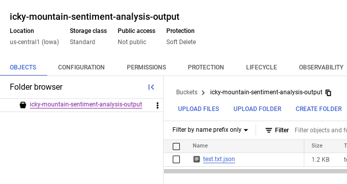

[](https://cloud.google.com/?utm_source=github&utm_medium=referral&utm_campaign=GCP&utm_content=packages_repository_banner)

# Perform Sentiment Analysis on your Text Data using Google Cloud

## Introduction
This architecture uses click-to-deploy to orchestrate a seamless sentiment analysis pipeline by leveraging Google Cloud's robust suite of services. It empowers users to glean valuable insights from text data through automated processes and intuitive visualizations.

At the heart of the pipeline is Google Cloud's Natural Language API which fers pre-trained models to developers for analyzing text and extracting insights like sentiment, entities, and syntax. Cloud Storage functions as a central repository for both input text files and analysis results. Upon the arrival of a new file, Cloud Functions is triggered, acting as the system's orchestrator. Cloud Functions subsequently invokes the NLP API. The API's output, in the form of structured JSON data, is then housed back to Cloud Storage. 

To facilitate in-depth exploration of the analysis results, the architecture integrates seamlessly with BigQuery, Google Cloud's fully managed data warehouse. Users can leverage BigQuery's powerful querying capabilities to uncover patterns and trends within the sentiment data. Furthermore, Looker Studio offers an intuitive visual interface for creating interactive dashboards and reports, allowing users to communicate their findings effectively.

In essence, this architecture delivers a cohesive solution for sentiment analysis, streamlining the entire workflow from data ingestion to insightful visualization. By harnessing the power of Google Cloud's managed services, users can unlock the hidden value within their text data without the need for extensive infrastructure management.

## Use cases
* __Customer Feedback Analysis__: Analyze customer reviews, surveys, social media comments, and other feedback channels. By understanding sentiment trends, businesses can identify areas for improvement, gauge customer satisfaction, and make data-driven decisions to enhance their products or services.
* __Brand Reputation Monitoring__ : Monitor online conversations, news articles, and social media mentions related to their brand. Sentiment analysis helps track public perception, identify potential PR crises, and measure the effectiveness of marketing campaigns.
* __Market Research__ : Analyze large volumes of unstructured data, such as customer reviews, social media discussions, or industry reports. Sentiment analysis helps identify emerging trends, competitor strategies, and customer preferences, providing valuable insights for market research and product development.
* __Social Media Monitoring__ : Leverage sentiment analysis to track social media conversations around specific topics, events, or products. This helps identify trending topics, gauge public opinion, and uncover potential opportunities or risks.
* __Employee Engagement Analysis__ : Analyzing employee feedback through surveys, emails, or internal communication channels, sentiment analysis can help organizations gauge employee morale, identify areas for improvement, and foster a positive work environment.


## Architecture

<p align="center"></p>

The main components that we would be setting up are (to learn more about these products, click on the hyperlinks)

* [Cloud Storage](https://cloud.google.com/storage) : for storing extracted data that must undergo some kind of transformation.
* [Cloud Functions](https://cloud.google.com/functions) : Run your code in the cloud with no servers or containers to manage with our scalable, pay-as-you-go functions as a service (FaaS) product.
* [Natural Language API](https://cloud.google.com/natural-language) : Derive insights from unstructured text using Google machine learning.
* [BigQuery](https://cloud.google.com/bigquery) : Serverless and cost-effective enterprise data warehouse that works across clouds and scales with your data.


## Costs

Pricing Estimates - We have created a sample estimate based on some usage we see from new startups looking to scale. This estimate would give you an idea of how much this deployment would essentially cost per month at this scale and you extend it to the scale you further prefer. Here's the [link](https://cloud.google.com/products/calculator/#id=17907c9a-d2d9-43c2-901d-028fd324a1b2).


## Deploy the architecture

**Time to complete**: About 10 minutes

1. Click on Open in Google Cloud Shell button below.

<a href="https://ssh.cloud.google.com/cloudshell/editor?shellonly=true&cloudshell_git_repo=https://github.com/GoogleCloudPlatform/click-to-deploy-solutions&cloudshell_workspace=nlp-sentiment-analysis&cloudshell_open_in_editor=infra/terraform.tfvars" target="_new">
    
</a>

2. Run the prerequisites script to enable APIs and set Cloud Build permissions.
```
sh prereq.sh
```

3. Run the Cloud Build Job
```
gcloud builds submit . --config cloudbuild.yaml
```

## Testing the architecture

Once you have deployed the solution successfully, upload the text file from the asset folder to the input bucket using either Cloud Console or gsutil.

Execute the command below to copy the file to the input bucket
```
PROJECT_NAME=$(gcloud config get-value project)
gsutil cp assets/test.txt gs://$PROJECT_NAME-sentiment-analysis
```

Then, check the parsed results in the output bucket in json (Key=value) format.

Navigate to the Output Bucket, in this case it would be 
<YOUR_PROJECT_ID>-Sentiment-analysis-Output to check the json results.

<p align="center"></p>


Navigate to BigQuery to view the Output of the sentiment analysis job.

<p align="center"></p>


## Destroying the architecture


Execute the command below on Cloud Shell to delete the resources.
```
gcloud builds submit . --config cloudbuild_destroy.yaml
```

This is not an official Google product.

