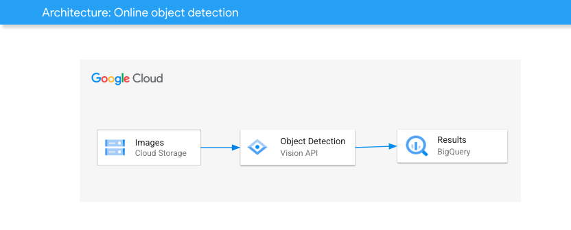
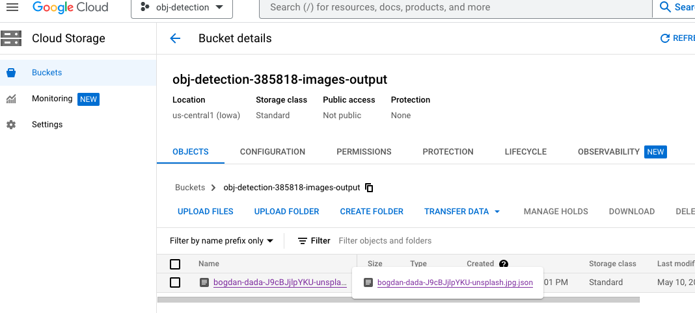
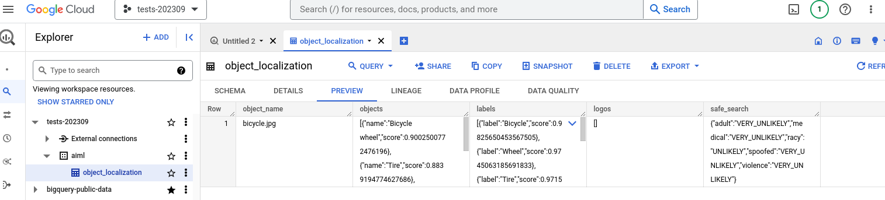

[](https://cloud.google.com/?utm_source=github&utm_medium=referral&utm_campaign=GCP&utm_content=packages_repository_banner)

# Identify Objects from Images using AI on Google Cloud

## Introduction

This architecture uses click-to-deploy so you can spin up a solution for detecting objects, labels, logos and perform safe search on images with Cloud Vision API

This architecture harnesses the power of Google Cloud Vision API to detect and extract objects from images with precise object localization. This architecture provides a robust and efficient solution for applications that require accurate object recognition and extraction capabilities.

At the core of this architecture is the Cloud Vision API, a powerful machine learning-based service that analyzes images to detect objects and their spatial location within the image. By leveraging state-of-the-art computer vision algorithms, the API can accurately identify and localize objects, providing bounding boxes that outline their exact positions.

In this example, the user uploads images to a bucket. This event triggers the Vision API that analyzes the image and saves the object detection results into a JSON file on Google Cloud Storage. BigQuery Transfer Service loads JSONs from the output bucket to a BigQuery table.

<p align="center"></p>

<p align="center"><b>Image credit: <a href="https://unsplash.com/photos/J9cBJjlpYKU"> Bogdan Dada </a> on <a href="https://unsplash.com/">Unsplash </a>(annotations added).</b> </p>

## Use cases

These are some examples of the use cases you can build on top of this architecture:

* __Visual Search and Recommendation Systems__ : The object detection and localization architecture can be utilized in visual search applications, allowing users to search for similar products or items based on specific objects within an image. 

* __Content Moderation and Filtering__ : Online platforms and social media networks often face the challenge of moderating user-generated content to ensure compliance with community guidelines and policies. By leveraging object detection and localization, the architecture can automatically identify and extract specific objects, enabling efficient content moderation.

* __Inventory Management and Product Categorization__ : Retail and e-commerce businesses can benefit from the solution's object detection capabilities to streamline inventory management and product categorization processes. By automatically extracting objects from product images, the architecture can assist in identifying and categorizing inventory items, improving stock management, and facilitating accurate product classification.


## Architecture

<p align="center"></p>

The main components that we would be setting up are (to learn more about these products, click on the hyperlinks)

* [Cloud Storage (GCS) bucket](https://cloud.google.com/storage/): for storing extracted data that must undergo some kind of transformation.
* [BigQuery](https://cloud.google.com/bigquery) : BigQuery is a serverless and cost-effective enterprise data warehouse that works across clouds and scales with your data. Use built-in ML/AI and BI for insights at scale.
* [Cloud Function](https://cloud.google.com/functions): Run your code in the cloud with no servers or containers to manage with our scalable, pay-as-you-go functions as a service (FaaS) product.
* [Cloud Vision API](https://cloud.google.com/vision): Use our game-changing fully managed development environment Vertex AI Vision to create your own computer vision applications or derive insights from images and videos with pre-trained APIs,  AutoML, or custom models.

## Costs
Pricing Estimates - We have created a sample estimate based on some usage we see from new startups looking to scale. This estimate would give you an idea of how much this deployment would essentially cost per month at this scale and you extend it to the scale you further prefer. Here's the [link](https://cloud.google.com/products/calculator#id=2fcc45ca-26e9-4089-aab2-d901b81886c6).

## Deploy

:clock1: Estimated deployment time: 6 min

1. Click on Open in Google Cloud Shell button below.

<a href="https://ssh.cloud.google.com/cloudshell/editor?cloudshell_git_repo=https://github.com/GoogleCloudPlatform/click-to-deploy-solutions&cloudshell_workspace=object-localization&cloudshell_open_in_editor=terraform/terraform.tfvars" target="_new">
    
</a>

2. Run the prerequisites script to enable APIs and set Cloud Build permissions.
```
sh prereq.sh
```

3. Run the Cloud Build Job
```
gcloud builds submit . --config cloudbuild.yaml
```

If you face a problem with the EventArc API during the deployment, please check out the [known issues section](#known-issues).


## Testing 

Once you deployed the solution successfully, upload an image to the image bucket using either Cloud Console or `gsutil`.

For example, you can download [this image](https://cloud.google.com/static/vision/docs/images/bicycle.jpg), and upload it to GCS using the command below. Note you must to replace the bucket name.
```
gsutil cp bicycle.jpg gs://<YOUR PROJECT NAME>-images
```

Then, you can check the object localization results into a JSON file in the output bucket:



The [BigQuery Transfer Service Job](https://console.cloud.google.com/bigquery/transfers) we create on this example runs every 15-min, and it will upload to BigQuery all image results in the output bucket. After it ran, you can check results on BigQuery.



Also, feel free to trigger the job anytime by clicking on the `RUN TRANSFER NOW` button.

## Destroy
Execute the command below on Cloud Shell to destroy the resources.
```
gcloud builds submit . --config cloudbuild_destroy.yaml
```

## Known issues

You might face errors related to Eventarc, for example:

```
Error: Error creating function: googleapi: Error 400: Validation failed for trigger projects/obj-localization/locations/us-central1/triggers/object-localization-109804: Invalid resource state for "": Permission denied while using the Eventarc Service Agent. If you recently started to use Eventarc, it may take a few minutes before all necessary permissions are propagated to the Service Agent. Otherwise, verify that it has Eventarc Service Agent role.

If you recently started to use Eventarc, it may take a few minutes before all necessary permissions are propagated to the Service Agent. Otherwise, verify that it has Eventarc Service Agent role.
```

It happens because the Eventarc permissions take some time to propagate. First, make sure you ran the `pre-req.sh` script. Then, wait some minutes and trigger the deploy job again. Please see the [Known issues for Eventarc](https://cloud.google.com/eventarc/docs/issues).

## Useful links
- [Form Parsing with Object Detection](https://codelabs.developers.google.com/codelabs/docai-form-parser-v1-python#0)
- [Use a Object Detection para processar seus formulários escritos à mão de maneira inteligente (Python)](https://codelabs.developers.google.com/codelabs/docai-form-parser-v3-python?hl=pt-br#0) (Portuguese)

