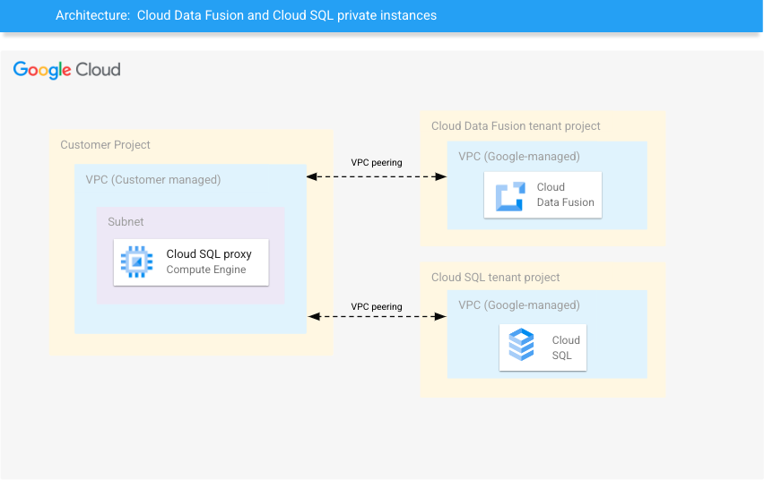

[](https://cloud.google.com/?utm_source=github&utm_medium=referral&utm_campaign=GCP&utm_content=packages_repository_banner)

# Integrate Cloud Data Fusion and Private Cloud SQL for a Robust Data Pipeline

## Introduction
This example deploys Cloud Data Fusion and Cloud SQL private instances, and establishes communication between them.

In today's data-driven world, businesses are challenged with efficiently ingesting, transforming, and analyzing large volumes of data from various sources. By combining the capabilities of Data Fusion and a Cloud SQL Private Instance, businesses can achieve their data processing and storage objectives while maintaining a high level of security and compliance.

Data Fusion offers a visual interface and a wide range of connectors and transformations, simplifying the data integration process. With Data Fusion, businesses can efficiently ingest and process data in real-time, ensuring up-to-date insights for their analytical workflows.

Cloud SQL Private Instance provides a dedicated, isolated environment for their database, protected by Google Cloud's robust security measures. It allows for fine-grained access control, encryption at rest, and network isolation, providing an added layer of protection for sensitive data.

In short, Data Fusion and Cloud SQL Private Instance can help businesses to:

* Efficiently ingest, transform, and analyze large volumes of data from various sources.
* Achieve their data processing and storage objectives.
* Maintain a high level of security and compliance.
* Provide a dedicated, isolated environment for their database.
* Protect their data with robust security measures.

## Use cases

These are some examples of the use cases you can build on top of this architecture:

* __Real-time data processing__: Google Cloud Data Fusion supports real-time data ingestion and processing. You can build streaming pipelines to process data as it arrives, enabling real-time analytics, monitoring, and decision-making. SQL can be used to query and transform streaming data in real time, allowing you to derive insights and trigger actions based on the data.
* __Data integration and ETL (Extract, Transform, Load)__:Google Cloud Data Fusion allows you to easily integrate data from multiple sources, such as databases, files, and APIs. With its visual interface, you can design data pipelines to extract data from various sources, apply transformations, and load it into target systems. SQL can be used within Data Fusion to perform complex transformations and data manipulation during the ETL process.
* __Data Exploration and Visualization__:Data Fusion can be used to prepare and transform data, and SQL can be used to query and aggregate the data into meaningful insights. These insights can then be visualized using tools like Google Data Studio, where you can create interactive dashboards and reports based on the SQL queries.
* __Data Integration and Consolidation__:When you have data scattered across multiple systems, Data Fusion can be used to integrate and consolidate the data into a unified view. SQL can then be employed to perform data cleansing, deduplication, and data quality checks, ensuring the consistency and integrity of the merged data.


## Architecture
<p align="center"></p>

The main components that we would be setting up are (to learn more about these products, click on the hyperlinks)

* [VPC](https://cloud.google.com/vpc) : Global virtual network that spans all regions. Single VPC for an entire organization, isolated within projects. Increase IP space with no downtime.
* [Compute Engine VM](https://cloud.google.com/compute) : Secure and customizable compute service that lets you create and run virtual machines on Google’s infrastructure.
* [Cloud SQL for MySQL](https://cloud.google.com/sql) : Fully managed relational database service for MySQL, PostgreSQL, and SQL Server with rich extension collections, configuration flags, and developer ecosystems.
* [Cloud Data Fusion](https://cloud.google.com/data-fusion) : Fully managed, cloud-native data integration at any scale.

## Costs
Pricing Estimates - We have created a sample estimate based on some usage we see from new startups looking to scale. This estimate would give you an idea of how much this deployment would essentially cost per month at this scale and you extend it to the scale you further prefer. Here's the [link](https://cloud.google.com/products/calculator#id=78109407-bdd1-4934-bfff-bf45c21756f3).

## Deploy

:clock1: Estimated deployment time: 18 min 49 sec

1. Click on Open in Google Cloud Shell button below.
<a href="https://ssh.cloud.google.com/cloudshell/editor?cloudshell_git_repo=https://github.com/GoogleCloudPlatform/click-to-deploy-solutions&cloudshell_workspace=private-cloud-data-fusion&cloudshell_open_in_editor=terraform/terraform.tfvars" target="_new">
    
</a>

2. Run the prerequisites script to enable APIs and set Cloud Build permissions.
```
sh prereq.sh
```

3. Run the Cloud Build Job
```
gcloud builds submit . --config cloudbuild.yaml
```

After you created the resources, you can use the Cloud SQL Proxy VM's internal IP to connect from Cloud Data Fusion to Cloud SQL. Before you can connect to the MySQL instance from the Cloud Data Fusion instance, install the MySQL JDBC driver from the Cloud Data Fusion Hub.

For more information on how to setup this connection, please refer to [this link](https://cloud.google.com/data-fusion/docs/how-to/connect-to-cloud-sql-source).

## Destroy
Execute the command below on Cloud Shell to destroy the resources.
```
gcloud builds submit . --config cloudbuild_destroy.yaml
```

## Useful links
- [Cloud Data Fusion How-to guides](https://cloud.google.com/data-fusion/docs/how-to)
- [Cloud SQL](https://cloud.google.com/sql)

## Tips
1. Use the private ip of the CloudSQL proxy in the Connection Name field in Fusion, not the CloudSLQ private ip
2. username for the database is: datafusion
3. get the password for the database in the Secret Manager
4. The MySQL database preconfigured is called employees

## For organizations with Shielded VMs enforcing policies
1. Configure the Dataproc nodes to use Shielded VMs
To do this, after you deployed the pipeline in Data Fusion, click in "Configure" and go to "Compute config"
Click in "Customize" in the prefered Profile Name
Go to the Shielded VMs section and click to change to True all the options
Enable secure boot, Enable vTPM and Enable integrity Monitoring
Now you can run the pipeline
