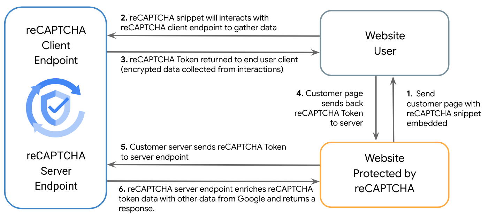
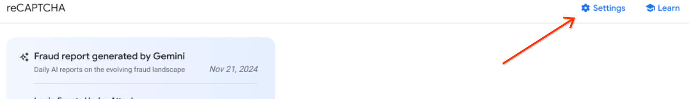
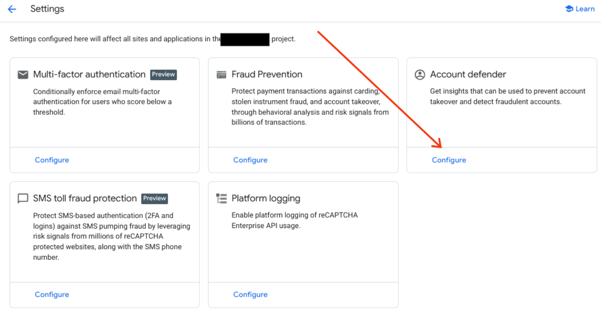
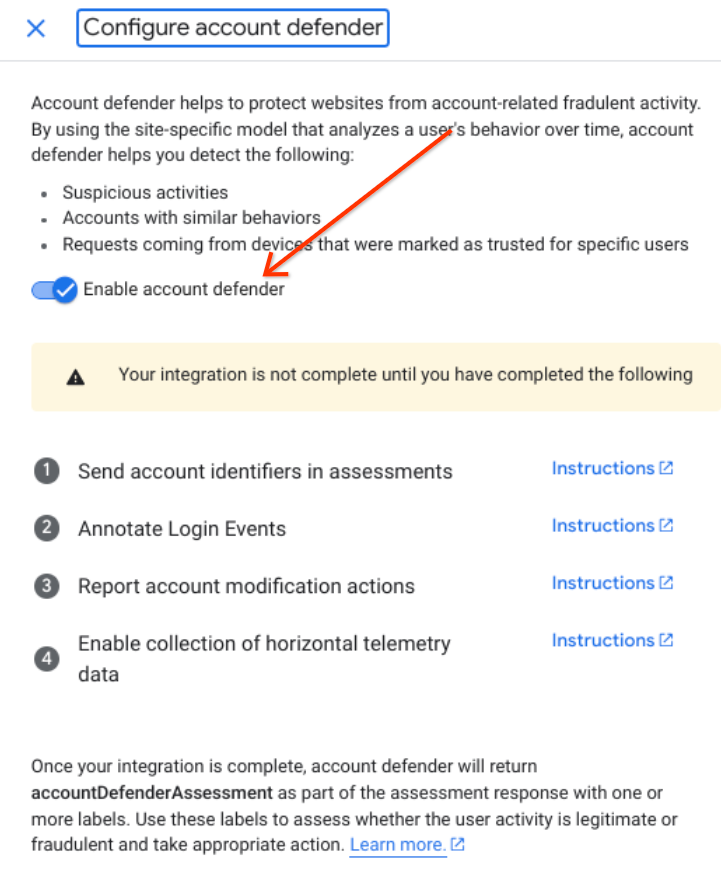

[](https://cloud.google.com/?utm_source=github&utm_medium=referral&utm_campaign=GCP&utm_content=packages_repository_banner)

# Protect your Application from Fraud, Automation, and Bot activity with reCAPTCHA

## Introduction

_This architecture uses click-to-deploy so you can spin up infrastructure and applications in minutes!_

reCAPTCHA leverages a sophisticated and adaptable risk analysis engine to shield against automated software, thwarting abusive activities within an organization’s website and mobile apps. It safeguards your website and mobile applications from abusive traffic without compromising the user experience. reCAPTCHA employs an invisible score-based detection mechanism to differentiate between legitimate users and bots or other malicious attacks.

This click to deploy demo implements reCAPTCHA into an application, and reveals on the web page the results of the API calls made. It demonstrates the key functionality of the product along with some of the advanced protection features.

## Architecture

<p align="center">  </p>

The main components that we would be setting up are (to learn more about these products, click on the hyperlinks):

* [reCAPTCHA](https://cloud.google.com/security/products/recaptcha) - reCAPTCHA is a service that helps to protect your websites and mobile applications from spam and abuse..
* [Cloud Build](https://cloud.google.com/build) - This demo includes an application that will be built in Google Cloud Build.
* [Cloud Run](https://cloud.google.com/run) - The demo application will be deployed to Google Cloud using Cloud run, where it can then be used through Cloud Run proxy.

## Costs

reCAPTCHA is billed volumetrically. It functions in two stages, the client side execute which is free, and an API call known as an assessment which is charged.

There are multiple tiers for reCAPTCHA (including a free tier). For more details see [reCAPTCHA Compare Tiers](https://cloud.google.com/recaptcha/docs/compare-tiers)

## Deploy the architecture

Estimated deployment time: 8 mins

1. Click on Open in Google Cloud Shell button below.

<a href="https://ssh.cloud.google.com/cloudshell/editor?cloudshell_git_repo=https://github.com/bigdavros/hero-dev-repo&cloudshell_workspace=/&cloudshell_open_in_editor=README.md" target="_new">
    
</a>

2. Run the script to deploy the demo. You will be prompted for variables by the script.
```
sh deploy.sh
```
## Accessing the demo

1. The deployment script will create a `run.sh` with the following contents, that will differ depending on your project and region
```
gcloud run services proxy recaptcha-demo-service-XXXXX --project PROJECT_ID --region REGION
```

2. Simply run the script with:
```
sh run.sh
```

## Cleaning up your environment
Run the command below on Cloud Shell to destroy the resources. 
```
bash cleanup.sh
```

## Browsing the Demo
The demo covers four main features:
 - Enterprise (Scoring and bot detection)
 - Annotations (feedback to reCAPTCHA)
 - Account Defender
 - Password Leak Detection

### Enterprise
CAPTCHA is a bad acronym for "Completely Automated Public Turing test to tell Computers and Humans Apart", so the score is rated from 1.0 down to 0.0 on how likely the visitor is to be a human. A score of 1 is a human.

When reCAPTCHA makes a site key, it needs time to "train" because it is fundamentally a machine learning model. While it is training the score will always be 0.9 with a reason code of "LOW_CONFIDENCE_SCORE". For this demo, the site keys are freshly made so expect a score of 0.9 in most places.

The Enterprise scoring page covers:
 - Score based challenges. This is where the JavaScript front end makes a token, then the application front end sends that token to a server to get checked. Learn more about interpretting scores [here](https://cloud.google.com/recaptcha-enterprise/docs/interpreting-scores).
 - Test 0.2. This is where the score is hard coded in the Google Cloud console to always return 0.2. This should only be used in test environments. Learn more about test keys [here](https://cloud.google.com/recaptcha/docs/faq#id_like_to_run_automated_tests_with_what_should_i_do).
- Test 0.8. This is where the score is hard coded in the Google Cloud console to always return 0.8. This should only be used in test environments. Learn more about test keys [here](https://cloud.google.com/recaptcha/docs/faq#id_like_to_run_automated_tests_with_what_should_i_do). 
- No image. You'll notice that the reCAPTCHA logo is hovering in a badge at the bottom right of the page. If you want to switch this off you'll need to place an inline notice. Learn more about hiding the badge [here](https://cloud.google.com/recaptcha/docs/faq#id_like_to_hide_the_badge_what_is_allowed).
- Visual Challenge. Love checkboxes and fire hydrants? This is for you. Learn more about Visual Challenges [here](https://cloud.google.com/recaptcha/docs/visual-challenge).
- Express. Have an application or use case that can't use JavaScript or a mobile SDK? Perhaps a set top box or thick client application? Get a less accurate score using only network data. Learn more about Express Challenges [here](https://cloud.google.com/recaptcha/docs/express-challenge).

### Annotations
You can supply feedback to reCAPTCHA through annotations. This is where you tell reCAPTCHA if it got something right, or indeed wrong. You can tell it something was LEGITIMATE or FRAUDULENT with a reason (or without). reCAPTCHA engineers will use this data to improve the service, which will make your scores more accurate. Learn more about annotations [here](https://cloud.google.com/recaptcha/docs/annotations).

### Switch on Account Defender
This feature provides advanced protection against account takeover and malicious creation activity. It needs to be switched on in the Google Cloud console.






### Using Account Defender
Account defender works by providing a user id. You can learn more about the feature, including all sub features [here](https://cloud.google.com/recaptcha-enterprise/docs/account-defender).

For the Normal usage here are some things to try:
 - Check the vistor and see what is sent and what is returned by reCAPTCHA.
 - Click on the annotate button to confirm that this visitor is LEGITIMATE (there's a button on the page for this)
 - Check the same visitor once again. See how the response now says "PROFILE_MATCH" for your visitor. This is because Account Defender now recognises the visitor and everything about the token that was made.
 - Make a new user id by pressing the refresh button and check the user now. The PROFILE_MATCH is now gone because the user id has changed.
 - Annotate this user too so that the rest of this section will make sense.

 For the unusual usage here is something to try:
  - The location is set to somewhere far from the place you are actually logging in from. Check the visitor.
  - See how Account Defender has detected that this login is suspicious. This is because it doesn't match the profile made from the last step.

For account creation try this:
 - Check the visitor "nasty_fraudster_123@example.com". reCAPTCHA knows something about this user from previous activity on the internet.
 - Notice how you get a warning of SUSPICIOUS_ACCOUNT_CREATION when a suspicious visitor makes an account. You can use this to detect phony sign ups to your application.

Demo disclaimer for Account Defender features.
 -  Please note that parts of the demo are not "live". If you look at the Java Source code you can see that some values are changed on the fly just to show how it would present in a real scenario. This is because it is really really hard to trick machine learning as powerful as reCAPTCHA, and much easier to change variable values in a demo.

### Password Leak Detection
Password Leak Detection detects leaked passwords. We spent a long time thinking about the name for this feature. You can learn more about this feature [here](https://cloud.google.com/recaptcha-enterprise/docs/password-leak-detection).

Unlike other products, reCAPTCHA Password Leak Detection checks if the username and password are in a breach, rather than just the password. This gives a much better understanding on how at risk a user is.

You can test a username/password using the form. You can do this using our privacy preserving algorithms. Some examples are included in the side menu. There's a small notice of "Leaked!" or "No leak found" on the demo page after you check.

