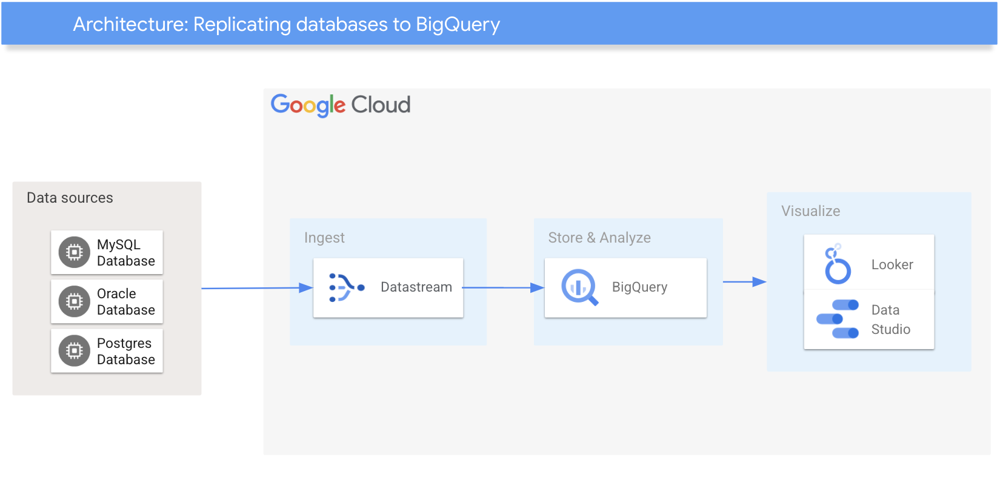

[](https://cloud.google.com/?utm_source=github&utm_medium=referral&utm_campaign=GCP&utm_content=packages_repository_banner)

# Replicate your Databases into a Data Warehouse solution for data analysis in Google Cloud

## Introduction

This architecture uses a click-to-deploy method to allow customers with traditional databases to stream data changes directly to BigQuery and visualize the data with [Looker Studio](https://support.google.com/datastudio/answer/6283323?hl=en) or [Looker](https://www.looker.com/).

In today's competitive business environment, organizations need to make informed decisions based on data insights to gain a competitive edge. Traditional SQL databases are reliable data storage systems, but they lack the advanced analytics and machine learning capabilities needed to extract valuable insights from large datasets efficiently. This limitation has led organizations to seek solutions that bridge the gap between their existing databases and enterprise-grade data warehouses like BigQuery.

BigQuery is a fully-managed data warehouse that offers a robust infrastructure and advanced analytical capabilities. It allows organizations to quickly extract actionable insights from their data. By replicating their SQL databases to BigQuery, organizations can seamlessly leverage its strengths to unlock the true potential of their data.

The replication process uses tools like Google Data Stream to ingest data from various sources, including relational databases and transactional systems, into BigQuery in near real-time. This continuous flow of data ensures that the data warehouse remains up-to-date with the latest changes from the source systems.

In summary, replicating SQL databases to BigQuery provides organizations with a seamless pathway to leverage the strong analytical and machine learning capabilities of an enterprise-grade data warehouse. It allows them to transition from traditional databases to a high-performance environment, unlocking the potential for faster data processing, advanced analytics, and actionable insights that drive business success.

## Use cases
These are some examples of the use cases you can build on top of this architecture:

* __Real-time analytics and reporting__ : Organizations that require up-to-the-minute insights for critical decision-making can benefit from this solution. By replicating data from transactional databases or other data sources to BigQuery in near real-time, businesses can generate real-time reports, dashboards, and visualizations that reflect the most current state of their data.

* __Data warehousing and historical analysis__ : Many organizations need to store and analyze large volumes of historical data for compliance, auditing, or long-term trend analysis purposes. By replicating data from source databases to BigQuery using Google Data Stream, organizations can maintain an up-to-date data warehouse that includes historical records. This allows them to perform complex queries and advanced analytics on a comprehensive dataset, uncover hidden patterns, identify historical trends, and gain deeper insights into their business performance over time.

* __Business Intelligence and Machine Learning__ : Organizations can leverage the real-time data availability in BigQuery to power BI tools and ML models. BI teams can build interactive dashboards, perform ad-hoc analysis, and create data visualizations using the most current data. ML engineers and data scientists can access real-time data to train and deploy models, enabling them to make accurate predictions and automate decision-making processes.

## Architecture

<p align="center"></p>

The main components that we would be setting up are (to learn more about these products, click on the hyperlinks)

* [VPC](https://cloud.google.com/vpc) Global virtual network that spans all regions. Single VPC for an entire organization, isolated within projects. Increase IP space with no downtime.
* [Data Stream](https://cloud.google.com/datastream/docs/overview) : serverless and easy-to-use change data capture (CDC) and replication service. It allows you to synchronize data across heterogeneous databases and applications reliably, and with minimal latency and downtime.
* [Cloud SQL for MySQL ](https://cloud.google.com/sql): Fully managed relational database service for MySQL, PostgreSQL, and SQL Server with rich extension collections, configuration flags, and developer ecosystems.

## Costs
Pricing Estimates - We have created a sample estimate based on some usage we see from new startups looking to scale. This estimate would give you an idea of how much this deployment would essentially cost per month at this scale and you extend it to the scale you further prefer. Here's the [link](https://cloud.google.com/products/calculator#id=512b38c3-7fcc-465e-9254-eb356903639e).

## Deploy

:clock1: Estimated deployment time: 10 min 16 sec

1. Click on Open in Google Cloud Shell button below.
<a href="https://ssh.cloud.google.com/cloudshell/editor?shellonly=true&cloudshell_git_repo=https://github.com/GoogleCloudPlatform/click-to-deploy-solutions&cloudshell_workspace=replicating-databases-bigquery&cloudshell_open_in_editor=terraform/terraform.tfvars" target="_new">
    
</a>

2. Run the prerequisites script to enable APIs and set Cloud Build permissions.
```
sh prereq.sh
```

3. Run the Cloud Build Job
```
gcloud builds submit . --config cloudbuild.yaml
```

## Destroy
Execute the command below on Cloud Shell to destroy the resources.
```
gcloud builds submit . --config cloudbuild_destroy.yaml
```

This is not an official Google product.
