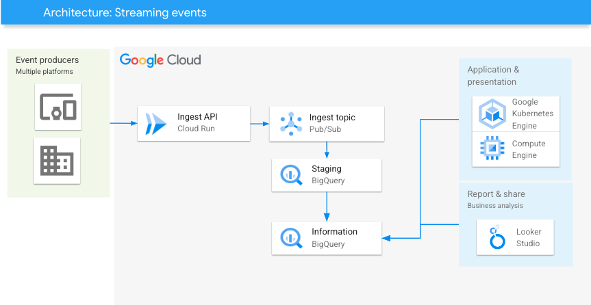

[](https://cloud.google.com/?utm_source=github&utm_medium=referral&utm_campaign=GCP&utm_content=packages_repository_banner)

# Stream events in real-time for data analytics on Google Cloud

## Introduction

This architecture uses click-to-deploy so you can spin up infrastructure in minutes using terraform!

Real-time event streaming is a powerful solution that allows companies to capture and analyze data as it happens, providing immediate insights and opportunities for real-time decision-making. There are several reasons why a company would want to stream real-time events:

* To stay proactive and responsive to rapidly changing conditions. By capturing and analyzing data as it happens, companies can quickly detect and react to critical events, emerging trends, or anomalies, enabling them to make data-driven decisions in near-real time.

* To unlock valuable insights that would otherwise be lost or delayed. Traditional batch processing methods often involve analyzing data after it has been stored, which can lead to a time lag between data collection and analysis. By streaming events in real time, companies can gain immediate visibility into customer behaviors, operational performance, and market dynamics, enabling them to make timely adjustments to strategies, campaigns, and operations.

* To simplify the development and deployment process. The seamless integration of Cloud Run API, Pub/Sub, and BigQuery allows organizations to focus on building event-driven applications and analytics workflows without the need for managing complex infrastructure or custom event processing pipelines. This accelerates time-to-market and reduces operational overhead.

## Use cases

These are some examples of the use cases you can build on top of this architecture:

* __Real-time Personalization and Customer Engagement__ : valuable for organizations focused on providing personalized customer experiences and improving customer engagement. By streaming events directly to BigQuery, organizations can analyze customer interactions, preferences, and behaviors in real time. This data can be used to dynamically personalize content, recommendations, and offers, enhancing the customer journey and driving customer satisfaction.

* __IoT Data Processing and Analytics__ : IoT devices generate a massive volume of events and sensor data in real time. By leveraging the Real-time Event Streaming Architecture, organizations can ingest and process IoT events in real time, enabling them to gain valuable insights and take immediate actions based on the data. For example, in a smart home environment, events from various sensors can be streamed to BigQuery for real-time analysis, allowing homeowners to automate tasks, monitor energy consumption, and enhance security in real time.

* __Real-time Monitoring and Alerting__ : Organizations that need to track and respond to events as they happen can leverage this architecture to receive events in near real-time and perform real-time analytics. By streaming events directly to BigQuery, organizations can monitor key metrics, detect anomalies or patterns, and trigger alerts or notifications based on predefined thresholds. This use case is particularly valuable for applications that require proactive monitoring, such as fraud detection, system health monitoring, or real-time performance tracking.

Overall, real-time event streaming is a powerful tool that can help companies stay ahead of the competition and make better decisions.

## Architecture
<p align="center"></p>

The main components that we would be setting up are (to learn more about these products, click on the hyperlinks)

* [BigQuery](https://cloud.google.com/bigquery): managed data warehouse solution that offers a powerful scalable SQL engine for analytical workloads
* [Pub/Sub topic](https://cloud.google.com/pubsub/docs/overview) : Pub/Sub is an asynchronous and scalable messaging service that decouples services producing messages from services processing those messages.
* [BQ subscription](https://cloud.google.com/pubsub/docs/bigquery) : A BigQuery subscription writes messages to an existing BigQuery table as they are received. You're not required to configure a subscriber client separately.
* [Cloud Run Ingest API](https://cloud.google.com/run) : Build and deploy scalable containerized apps written in any language (including Go, Python, Java, Node.js, .NET, and Ruby) on a fully managed platform. 

## Costs

Pricing Estimates - We have created a sample estimate based on some usage we see from new startups looking to scale. This estimate would give you an idea of how much this deployment would essentially cost per month at this scale and you extend it to the scale you further prefer. Here's the [link](https://cloud.google.com/products/calculator/#id=72845cbb-a872-46f2-930d-48280241d364).

Note : The estimated example considers a single event ingestion.

## Deploy

:clock1: Estimated deployment time: 2 min

1. Click on Open in Google Cloud Shell button below.

<a href="https://ssh.cloud.google.com/cloudshell/editor?shellonly=true&cloudshell_git_repo=https://github.com/GoogleCloudPlatform/click-to-deploy-solutions&cloudshell_workspace=streaming-data-to-analytics&cloudshell_open_in_editor=terraform/terraform.tfvars" target="_new">
    
</a>

2. Run the script below to execute the pre-reqs required to deploy the solution.
```
sh prereq.sh
```

3. Run the Cloud Build Job
```
gcloud builds submit . --config cloudbuild.yaml
```

## Test your solution
If you want to run a load test, please follow the instructions below.

1. Set GCP_TOKEN env var
```
export GCP_TOKEN=$(gcloud auth print-identity-token)
```

2. Create a python virtual env and activate it
```
cd load_test
python3 -m virtualenv venv
source venv/bin/activate
pip install -r requirements.txt
```

3. Run locust with your Cloud Run Service URL as target, for example:
```
locust -f locustfile.py --headless -u 100 -r 10 \
    --run-time 30m \
    -H https://<YOUR CLOUD RUN SERVICE URL>/
```

4. Query the events on [BigQuery](https://console.cloud.google.com/bigquery)
```
SELECT *
FROM `ecommerce_raw.order_event`
WHERE DATE(publish_time) >= CURRENT_DATE()
LIMIT 1000
```


## Destroy
Execute the command below on Cloud Shell to destroy the resources.
```
gcloud builds submit . --config cloudbuild_destroy.yaml
```

This is not an official Google product.
