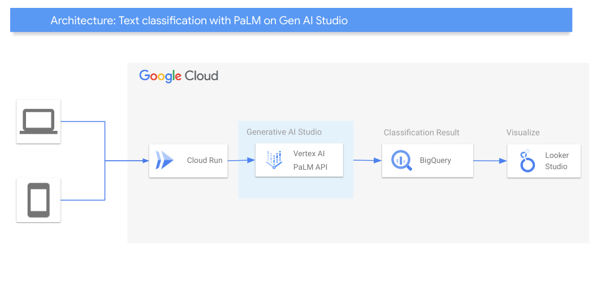

# Classify texts using Google GenAI

## Introduction
In today's data-driven world, the ability to quickly and accurately classify texts is crucial for various applications across industries. This guide provides a step-by-step approach to setting up and using Google's Generative AI (GenAI) to classify texts. Leveraging the power of GenAI, we will classify texts and store the results in BigQuery. The classified data can then be visualized in Looker Studio, offering powerful insights and easy access to meaningful patterns within the texts.

This guide is designed for users who already have a Google Cloud project and want to explore how to integrate GenAI into their workflows. Whether you're looking to categorize customer feedback, filter emails, or classify documents, this solution provides a scalable and efficient method to process and analyze large volumes of text.

This package will get you up to speed with an infrastructure to classify texts using GenAI, store the texts in BigQuery and then visualise those into a Looker Studio dashboard.

## Use cases
The versatility of GenAI text classifications extends across numerous industries, offering seamless integration with your business operations. Here are some applicable use cases of GenAI text classifications:

* __Organizing Medical and Legal Documents__: Efficiently classify and manage large volumes of documents such as patient records, legal filings, and research articles. This enhances the retrieval and organization of information, helping healthcare professionals quickly access patient histories and legal researchers find relevant case laws and statutes.
* __Automating Product Tagging and Categorization__: Streamline e-commerce operations by automatically tagging and categorizing products based on their descriptions and customer reviews. This automation improves product management, ensures accurate tagging, and enhances the shopping experience by making products easier to find for customers.
* __Prioritizing and Routing Support Tickets__: Improve customer service efficiency by categorizing support tickets into specific categories like "Technical Issues," "Billing Inquiries," and "Payment Problems." This helps in prioritizing and routing tickets to the appropriate support teams, ensuring timely and accurate responses to customer queries.
* __Medical Diagnosis Support__: Accelerate the diagnostic process by classifying medical reports and patient notes. This supports healthcare professionals in quickly identifying relevant information, aiding in faster diagnosis and treatment, and improving patient care by leveraging detailed and structured medical data.
* __Detecting and Preventing Plagiarism__: Enhance academic integrity by identifying instances of plagiarism in student assignments and research papers. This use case helps educational institutions maintain high standards by ensuring that all submitted work is original and complies with academic policies, fostering a culture of honesty and creativity.

## Architecture
<p align="center"></p>


These are the main components that we would be setting up (to learn more about these products, click on the hyperlinks):
* [Cloud Run](https://cloud.google.com/run): serverless PaaS offering to host containers for web-oriented applications, while offering security, scalability and easy versioning.
* [Vertex AI PaLM API](https://cloud.google.com/vertex-ai/generative-ai/docs/language-model-overview#palm-api):Use advanced language models for natural language processing tasks. Ideal for building chatbots, text analysis tools, and translation services.
* [BigQuery](https://cloud.google.com/bigquery): A Serverless and cost-effective enterprise data warehouse that works across clouds and scales with your data. 
* [Looker Studio](https://support.google.com/looker-studio/answer/6283323?hl=en): Looker Studio is a free tool that turns your data into informative, easy to read, easy to share, and fully customizable dashboards and reports.


## Let's get started

This solution assumes you already have a project created and set up where you wish to host these resources.

**Time to complete**: About 5 minutes

Click the **Start** button to move to the next step.

## Prerequisites

* Have an [organization](https://cloud.google.com/resource-manager/docs/creating-managing-organization) set up in Google cloud.
* Have a [billing account](https://cloud.google.com/billing/docs/how-to/manage-billing-account) set up.
* Have an existing [project](https://cloud.google.com/resource-manager/docs/creating-managing-projects) with [billing enabled](https://cloud.google.com/billing/docs/how-to/modify-project).
* The project has to be able to share resources outside the domain (i.e. to get public requests), [check the domain restricted sharing policy](https://cloud.google.com/resource-manager/docs/organization-policy/restricting-domains#console).

### Roles & Permissions

In order to spin up this architecture, you will need to be a user with the “__Project owner__” [IAM](https://cloud.google.com/iam) role on the existing project:

Note: To grant a user a role, take a look at the [Granting and Revoking Access](https://cloud.google.com/iam/docs/granting-changing-revoking-access#grant-single-role) documentation.

## Deploy the architecture

Before we deploy the architecture, you will need the following information:

* The __project ID__

Once the repository is cloned please run the following command to install the prerequisistes:

```
sh prereq.sh
```

You will then be prompted to provide the project-id for the destination project.

After this is complete, you can kick off the Cloud Build pipeline with the following command:

```
gcloud builds submit . --config build/cloudbuild.yaml --region us-central1
```

The region is the region where the cloudbuild will run as well as the region where the resulting compiled image of the sourcecode will be stored, if you update the region, it is important to also update it in the terraform variables.


## Result

At this point you have successfully deployed the application and necessary underlining infrastructure to run it! Yay!

This process may take a while to deploy, please do not close the window when deploying.

Next we are going to test the architecture and finally clean up your environment.

## Getting the endpoint
* Visit Cloud Run list of services (https://console.cloud.google.com/run) 
* Select the service called text-classification	
* The service endpoint will be available right next to the package name


## Testing your architecture
Once you deployed the solution successfully, update the populate.sh with the endpoint you got from the previous step


```bash
sh populate.sh
```

Then, check the parsed results in the output bucket in text (OCR) and json (Key=value) formats

Finally, check the json results on BigQuery or even better, use the bellow link to check it in a Looker Studio dashboard.

```
https://lookerstudio.google.com/c/u/0/reporting/create?c.mode=edit&ds.connector=BIG_QUERY&ds.type=TABLE&ds.projectId=[YOUR PROJECT ID]&ds.datasetId=classified_messages&ds.tableId=classified_messages
```

## Cleaning up your environment

Execute the command below on Cloud Shell to destroy the resources.

``` {shell}
gcloud builds submit . --config build/cloudbuild_destroy.yaml
```

The above command will delete the associated resources so there will be no billable charges made afterwards.

## Congratulations

<walkthrough-conclusion-trophy></walkthrough-conclusion-trophy>
