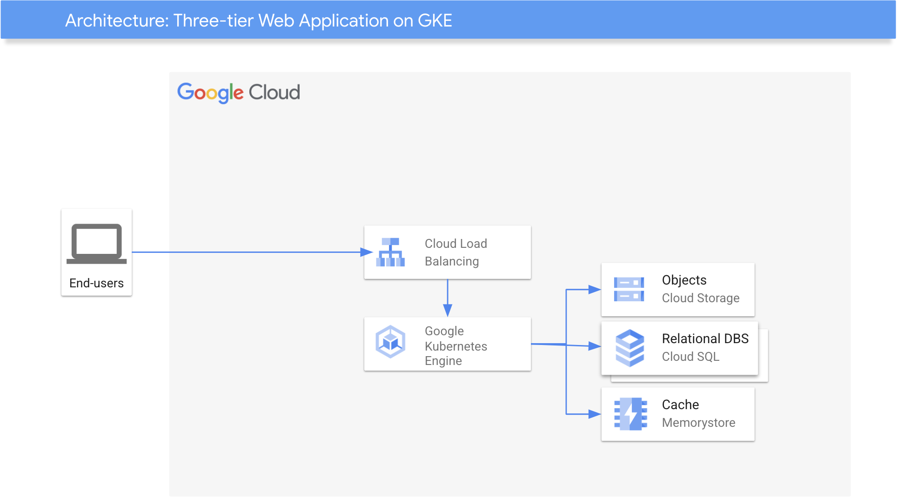

# Three-tier Web Application using GKE

This is a stack that deploys a Three-tier Autoscaling Web Application using GKE.

This repository contains Terraform sample code to deploy Gke, Cloud Storage and Cloud SQL private instances, and establish communication between them.

Resources created
- VPC
- GKE
- Cloud SQL for MySQL
- Cloud Storage



## Deploy

1. Click on Open in Google Cloud Shell button below.
<a href="https://ssh.cloud.google.com/cloudshell/editor?shellonly=true&cloudshell_git_repo=https://github.com/GoogleCloudPlatform/private-cloud-data-fusion" target="_new">
    
</a>

2. Run the `deploy.sh` script
```
sh cloudbuild.sh
```
## Destroy
Execute the command below on Cloud Shell to destroy the resources.
```
sh cloudbuild.sh destroy
```

This is not an official Google product.