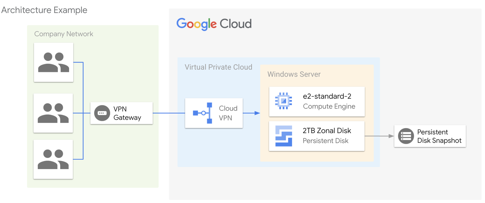

[](https://cloud.google.com/?utm_source=github&utm_medium=referral&utm_campaign=GCP&utm_content=packages_repository_banner)

# Windows File Server on Google Cloud

## Introduction

This architecture uses click-to-deploy to create an example of building a 2TB capacity Windows file server environment on Google Cloud.

The Windows File Server architecture on Google Cloud provides a robust and reliable environment for efficient data storage and management. This architecture utilizes a 2TB persistent disk, offering ample storage capacity to accommodate your growing file storage needs.

With disk snapshot enabled, you can ensure data protection and quick disaster recovery. The snapshot feature allows you to capture the state of your disk at a specific point in time, creating a backup that can be easily restored in case of data loss or system failures.

By leveraging the power of Google Cloud, this file server environment offers high scalability, performance, and security. You can effortlessly scale up or down your storage capacity as required, ensuring that your file server can adapt to your changing business demands. Additionally, Google Cloud's robust security measures, including encryption and access controls, provide a secure environment for your sensitive data.

## Use cases
These are some examples of the use cases you can build on top of this architecture:

* __Enterprise File Sharing and Collaboration__ : Teams can securely store, access, and collaborate on documents, presentations, and other files, ensuring data integrity and version control. With snapshot backups, accidental deletions or data corruption can be easily recovered, minimizing downtime and ensuring business continuity.

* __Application Data Storage__ : Many applications require a reliable and scalable file storage solution to store user-generated content, configuration files, or other application-specific data.

* __Hybrid Cloud File Storage__ : This enables seamless integration between on-premises infrastructure and Google Cloud, facilitating data mobility and flexibility. Organizations can leverage the scalability and accessibility of the cloud while maintaining control over their data.

:clock1: Estimated deployment time: 1 min 25 seg

## Arquitecture

<p align="center"></p>

The main components that we would be setting up are (to learn more about these products, click on the hyperlinks)

* [VPC](https://cloud.google.com/vpc) : Global virtual network that spans all regions. Single VPC for an entire organization, isolated within projects. Increase IP space with no downtime.
* [GCP](https://cloud.google.com/compute) : Secure and customizable compute service that lets you create and run virtual machines on Google’s infrastructure.
* [Persistent Disk](https://cloud.google.com/compute/docs/disks) : Persistent Disk volumes provide high-performance and redundant network storage.

## Deploy

1. Click on Open in Google Cloud Shell button below.
<a href="https://ssh.cloud.google.com/cloudshell/editor?shellonly=true&cloudshell_git_repo=https://github.com/GoogleCloudPlatform/click-to-deploy-solutions&cloudshell_workspace=windows-fileserver" target="_new">
    
</a>

2. Run the `deploy.sh` script
```
sh cloudbuild.sh
```
## Destroy
Execute the command below on Cloud Shell to destroy the resources.
```
sh cloudbuild.sh destroy
```

This is not an official Google product.