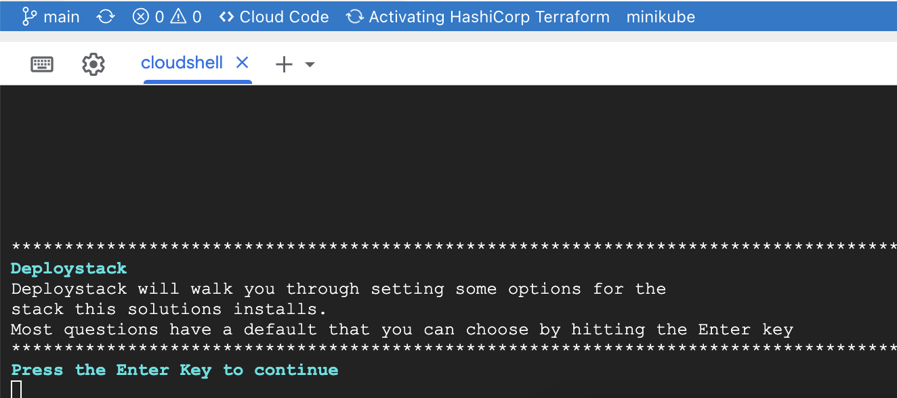

[](https://cloud.google.com/?utm_source=github&utm_medium=referral&utm_campaign=GCP&utm_content=packages_repository_banner)
# Host a Serverless Wordpress Site with Cloud Run

## Introduction

_This architecture uses click-to-deploy so you can spin up infrastructure in minutes using terraform!_

43% of the Web is built on Wordpress. Because of its simplicity and versatility, Wordpress can be used for internal websites and customer facing e-commerce platforms in small to large businesses, while still offering security. **Cloud Run automatically scales your WordPress application to handle any amount of traffic**, without requiring manual intervention. This means that your website can handle large traffic spikes, without worrying about capacity.

Cloud Run allows you to deploy your WordPress application quickly and easily, with a few clicks or commands. You can deploy your application from a container image stored in a container registry or directly from a Git repository. This click-to-deploy architecture leverages the serverless and scalability benefits of using Cloud Run to host a Wordpress Application connected to a PostgreSQL instance.

This repo is based on the Cloud Foundation Fabric blueprint available [here](https://github.com/GoogleCloudPlatform/cloud-foundation-fabric/tree/master/blueprints/third-party-solutions/wordpress/cloudrun).

## Use cases

These are some of the use cases you can build on top of this infrastructure:
* Business websites
* E-commerce websites
* Portfolios
* Non-profit websites
* Educational Websites

## Architecture


The main components that are deployed in this architecture are the following (you can learn about them by following the hyperlinks):

* [Cloud Run](https://cloud.google.com/run): serverless PaaS offering to host containers for web-oriented applications, while offering security, scalability and easy versioning
* [Cloud SQL](https://cloud.google.com/sql): Managed solution for SQL databases
* [VPC Serverless Connector](https://cloud.google.com/vpc/docs/serverless-vpc-access): Solution to access the CloudSQL VPC from Cloud Run, using only internal IP addresses

## Costs

Pricing Estimates - We have created a sample estimate based on some usage we see from new startups looking to scale. This estimate would give you an idea of how much this deployment would essentially cost per month at this scale and you extend it to the scale you further prefer. Here's the [link](https://cloud.google.com/products/calculator#id=8a7471c9-98df-4b71-97de-6222d22484c8).


## Setting up the project for the deployment

This example will deploy all its resources into the project defined by the `project_id` variable. Please note that we assume this project already exists. However, if you provide the appropriate values to the `project_create` variable, the project will be created as part of the deployment.

If `project_create` is set to null, the identity performing the deployment needs the `owner` role on the project defined by the `project_id` variable. Otherwise, the identity performing the deployment needs `resourcemanager.projectCreator` on the resource hierarchy node specified by `project_create.parent` and `billing.user` on the billing account specified by `project_create.billing_account_id`.

## Deploy the architecture

Before we deploy the architecture, you will need the following information:

* The __service project ID__.
* A __unique prefix__ that you want all the deployed resources to have (for example: awesomestartup). This must be a string with no spaces or tabs.
* A __Wordpress image__ if you want to use your own, otherwise you can use the provided standard image.
* A __list of Groups or Users__ with Service Account Token creator role on Service Accounts in IAM format, eg 'group:group@domain.com'.

**Notes**:

1. If you want to change your admin password later on, please note that you can only do so via the Wordpress user interface.
2. If you have the [domain restriction org. policy](https://cloud.google.com/resource-manager/docs/organization-policy/restricting-domains) on your organization, you have to edit the `cloud_run_invoker` variable and give it a value that will be accepted in accordance to your policy.

Click on the button below, sign in if required and when the prompt appears, click on “confirm”. It will walk you through setting up your architecture.

[](https://shell.cloud.google.com/cloudshell/editor?cloudshell_git_repo=https%3A%2F%2Fgithub.com%2FGoogleCloudPlatform%2Fdeploystack-wordpress-on-cloudrun&cloudshell_image=gcr.io%2Fds-artifacts-cloudshell%2Fdeploystack_custom_image&cloudshell_git_branch=main&cloudshell_tutorial=tutorial.md)


This is the startup screen that appears after clicking the button and confirming:



During the process, you will be asked for some user input. All necessary variables are explained at the bottom of this ReadMe file. In case of failure, you can simply click the button again.

<center>
<h4>🎉 Congratulations! 🎉  <br />
You have successfully deployed the foundation for running Wordpress using CloudRun on Google Cloud.</h4></center>


**Note**: 
You might get the following error (or a similar one):

``` {shell}
│ Error: resource is in failed state "Ready:False", message: Revision '...' is not ready and cannot serve traffic.│
```

In case this happens, manually run
``` {shell}
    deploystack install
```
to run the installation again.

## Using the Wordpress Installation

Upon completion, you will see the output with the values for the Cloud Run service and the user and password to access the `/admin` part of the website. You can also view it later with:

``` {shell}
terraform output
# or for the concrete variable:
terraform output cloud_run_service
```

When clicking on the Wordpress link, it will immediately prompt you to register as an administrator. The password will be pre-filled and can be changed after registration. 

## Cleaning Up Your Environment

The easiest way to remove all deployed resources is to run the following command in Cloud Shell:

``` {shell}
deploystack uninstall
```

The above command will delete the associated resources so there will be no billable charges made afterwards.
<!-- BEGIN TFDOC -->

## Special Thanks
A special thank you goes out to Natalia Strelkova (skalolazka) and Grigory Movsesyan, the original developers of this example architecture.

## Variables

| name | description | type | default |
|---|---|:---:|:---:|
| [project_id](variables.tf#L78) | Project id, references existing project if `project_create` is null. | <code>string</code> | |
| [wordpress_image](variables.tf#L89) | Image to run with Cloud Run, starts with \"gcr.io\" | <code>string</code> | mirror.gcr.io/library/wordpress |
| [cloud_run_invoker](variables.tf#L18) | IAM member authorized to access the end-point (for example, 'user:YOUR_IAM_USER' for only you or 'allUsers' for everyone) | <code>string</code> | <code>&#34;allUsers&#34;</code> |
| [cloudsql_password](variables.tf#L24) | CloudSQL password (will be randomly generated by default) | <code>string</code> |  <code>null</code> |
| [connector](variables.tf#L30) | Existing VPC serverless connector to use if not creating a new one | <code>string</code> |  <code>null</code> |
| [create_connector](variables.tf#L36) | Should a VPC serverless connector be created or not | <code>bool</code> |  <code>true</code> |
| [ip_ranges](variables.tf#L43) | CIDR blocks: VPC serverless connector, Private Service Access(PSA) for CloudSQL, CloudSQL VPC | <code title="object&#40;&#123;&#10;  connector &#61; string&#10;  psa       &#61; string&#10;  sql_vpc   &#61; string&#10;&#125;&#41;">object&#40;&#123;&#8230;&#125;&#41;</code> | <code title="&#123;&#10;  connector &#61; &#34;10.8.0.0&#47;28&#34;&#10;  psa       &#61; &#34;10.60.0.0&#47;24&#34;&#10;  sql_vpc   &#61; &#34;10.0.0.0&#47;20&#34;&#10;&#125;">&#123;&#8230;&#125;</code> |
| [prefix](variables.tf#L57) | Unique prefix used for resource names. Not used for project if 'project_create' is null. | <code>string</code> |  <code>&#34;&#34;</code> |
| [principals](variables.tf#L63) | List of users to give rights to (CloudSQL admin, client and instanceUser, Logging admin, Service Account User and TokenCreator), eg 'user@domain.com'. | <code>list&#40;string&#41;</code> | <code>&#91;&#93;</code> |
| [project_create](variables.tf#L69) | Provide values if project creation is needed, uses existing project if null. Parent is in 'folders/nnn' or 'organizations/nnn' format. | <code title="object&#40;&#123;&#10;  billing_account_id &#61; string&#10;  parent             &#61; string&#10;&#125;&#41;">object&#40;&#123;&#8230;&#125;&#41;</code> | <code>null</code> |
| [region](variables.tf#L83) | Region for the created resources | <code>string</code> |  | <code>&#34;europe-west4&#34;</code> |
| [wordpress_password](variables.tf#L94) | Password for the Wordpress user (will be randomly generated by default) | <code>string</code> | <code>null</code> |
| [wordpress_port](variables.tf#L100) | Port for the Wordpress image | <code>number</code> | <code>8080</code> |

## Outputs

| name | description | sensitive |
|---|---|:---:|
| [cloud_run_service](outputs.tf#L17) | CloudRun service URL | ✓ |
| [cloudsql_password](outputs.tf#L23) | CloudSQL password | ✓ |
| [wp_password](outputs.tf#L29) | Wordpress user password | ✓ |
| [wp_user](outputs.tf#L35) | Wordpress username |  |

<!-- END TFDOC -->
